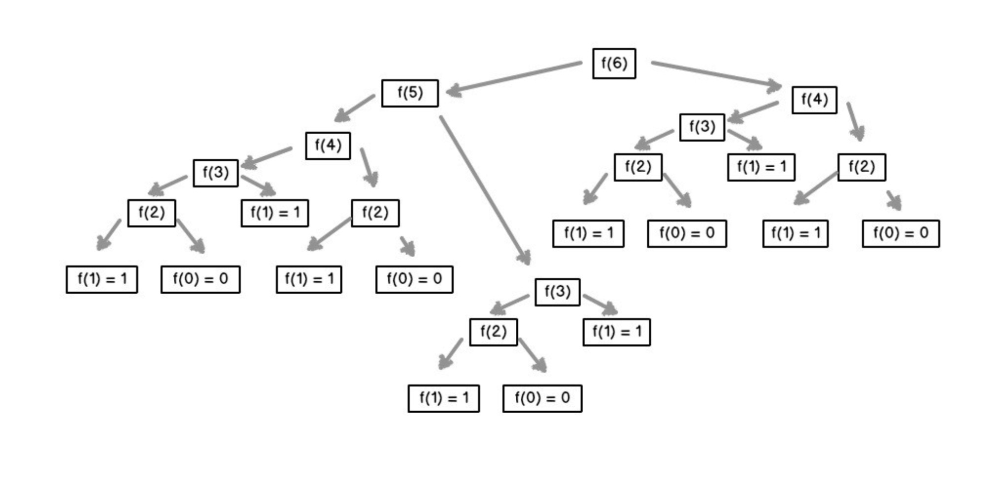

<!--
 * @Author: zhangyu
 * @Email: zhangdulin@outlook.com
 * @Date: 2021-07-15 16:19:33
 * @LastEditors: zhangyu
 * @LastEditTime: 2022-11-09 20:23:30
 * @Description:
-->

## 概念

递归是一种解决问题的有效方法，在递归过程中，函数将自身作为子例程调用。

你可能想知道如何实现调用自身的函数。诀窍在于，每当递归函数调用自身时，它都会将给定的问题拆解为子问题。递归调用继续进行，直到到子问题无需进一步递归就可以解决的地步。

为了确保递归函数不会导致无限循环，它应具有以下属性：

- 一个简单的基本案例 —— 能够不使用递归来产生答案的终止方案。
- 一组规则，也称作递推关系，可将所有其他情况拆分到基本案例。

### 重复计算

一些问题使用递归考虑，思路是非常清晰的，但是却不推荐使用递归，例如下面的几个问题：

- 斐波拉契数列
- 跳台阶
- 矩形覆盖
- 这几个问题使用递归都有一个共同的缺点，那就是包含大量的重复计算，如果递归层次比较深的话，直接会导致 JS 进程崩溃。

你可以使用记忆化的方法来避免重复计算，即开辟一个额外空间来存储已经计算过的值，但是这样又会浪费一定的内存空间。因此上面的问题一般会使用动态规划求解。

> 所以，在使用递归之前，一定要判断代码是否含有重复计算，如果有的话，不推荐使用递归。

递归是一种思想，而非一个类型，很多经典算法都是以递归为基础，因此这里就不再给出更多问题。
