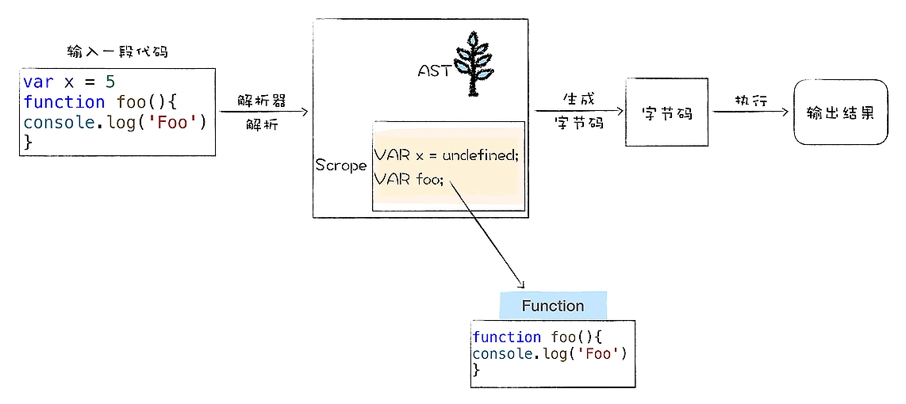
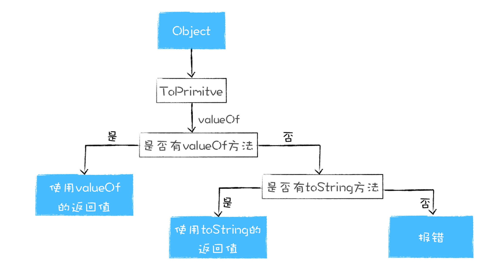

<!--
 * @Author: zhangyu
 * @Email: zhangdulin@outlook.com
 * @Date: 2022-09-21 18:51:48
 * @LastEditors: zhangyu
 * @LastEditTime: 2022-10-17 19:56:32
 * @Description: 
-->

## JavaScript设计思想篇 
### 快属性和慢属性：V8是怎样提升对象属性访问速度的？
V8 实现对象存储时，并没有完全采用字典的存储方式，这主要是出于性能的考量。因为字典是非线性的数据结构，查询效率会低于线性的数据结构，V8 为了提升存储和查找效率，采用了一套复杂的存储策略。

之所以出现这样的结果，是因为在 ECMAScript 规范中定义了数字属性应该按照索引值大小升序排列，字符串属性根据创建时的顺序升序排列。在这里我们把对象中的数字属性称为排序属性，在 V8 中被称为 elements，字符串属性就被称为常规属性，在 V8 中被称为 properties。

V8 内部是如何存储对象的，因为 JavaScript 中的对象是由一组组属性和值组成的，所以最简单的方式是使用一个字典来保存属性和值，但是由于字典是非线性结构，所以如果使用字典，读取效率会大大降低。为了提升查找效率，V8 在对象中添加了两个隐藏属性，排序属性和常规属性，element 属性指向了 elements 对象，在 elements 对象中，会按照顺序存放排序属性。properties 属性则指向了 properties 对象，在 properties 对象中，会按照创建时的顺序保存常规属性。通过引入这两个属性，加速了 V8 查找属性的速度，为了更加进一步提升查找效率，V8 还实现了内置内属性的策略，当常规属性少于一定数量时，V8 就会将这些常规属性直接写进对象中，这样又节省了一个中间步骤。但是如果对象中的属性过多时，或者存在反复添加或者删除属性的操作，那么 V8 就会将线性的存储模式降级为非线性的字典存储模式，这样虽然降低了查找速度，但是却提升了修改对象的属性的速度。

### 函数表达式：涉及大量概念，函数表达式到底该怎么学？  


在编译阶段，如果解析到函数声明，那么 V8 会将这个函数声明转换为内存中的函数对象，并将其放到作用域中。同样，如果解析到了某个变量声明，也会将其放到作用域中，但是会将其值设置为 undefined，表示该变量还未被使用。

在 V8 解析 JavaScript 源码的过程中，如果遇到普通的变量声明，那么便会将其提升到作用域中，并给该变量赋值为 undefined，如果遇到的是函数声明，那么 V8 会在内存中为声明生成函数对象，并将该对象提升到作用域中。

因为小括号之间存放的必须是表达式，所以如果在小阔号里面定义一个函数，那么 V8 就会把这个函数看成是函数表达式，执行时它会返回一个函数对象。存放在括号里面的函数便是一个函数表达式，它会返回一个函数对象，如果我直接在表达式后面加上调用的括号，这就称为立即调用函数表达式（IIFE），
比如下面代码：
```js
(function () {   
   //statements
})()
```
因为函数立即表达式也是一个表达式，所以 V8 在编译阶段，并不会为该表达式创建函数对象。这样的一个好处就是不会污染环境，函数和函数内部的变量都不会被其他部分的代码访问到。在 ES6 之前，JavaScript 中没有私有作用域的概念，如果在多人开发的项目中，你模块中的变量可能覆盖掉别人的变量，所以使用函数立即表达式就可以将我们内部变量封装起来，避免了相互之间的变量污染。

另外，因为函数立即表达式是立即执行的，所以将一个函数立即表达式赋给一个变量时，不是存储 IIFE 本身，而是存储 IIFE 执行后返回的结果。如下所示：
```js
var a = (function () {
    return 1
})()
```

### 原型链：V8是如何实现对象继承的？
继承就是一个对象可以访问另外一个对象中的属性和方法，在JavaScript 中，我们通过原型和原型链的方式来实现了继承特性。
### 作用域链：V8是如何查找变量的？
因为词法作用域是根据函数在代码中的位置来确定的，作用域是在声明函数时就确定好的了，所以我们也将词法作用域称为静态作用域。和静态作用域相对的是动态作用域，动态作用域并不关心函数和作用域是如何声明以及在何处声明的，只关心它们从何处调用。换句话说，作用域链是基于调用栈的，而不是基于函数定义的位置的。
### 类型转换：V8是怎么实现1+“2”的？
什么是类型系统 (Type System)？
> 在计算机科学中，类型系统（type system）用于定义如何将编程语言中的数值和表达式归类为许多不同的类型，如何操作这些类型，这些类型如何互相作用。



当 V8 执行 1+“2”时，因为这是两个原始值相加，原始值相加的时候，如果其中一项是字符串，那么 V8 会默认将另外一个值也转换为字符串，相当于执行了下面的操作：

```js
Number(1).toString() + "2"
```

这里，把数字 1 偷偷转换为字符串“1”的过程也称为强制类型转换，因为这种转换是隐式的，所以如果我们不熟悉语义，那么就很容易判断错误。我们还可以再看一个例子来验证上面流程，你可以看下面的代码：

```js
var Obj = {   
   toString() {
      return '200'   
    },    
    valueOf() { 
      return 100   
    } 
}  
```
Obj+3执行这段代码，你觉得应该返回什么内容呢？上面我们介绍过了，由于需要先使用 ToPrimitive 方法将 Obj 转换为原生类型，而 ToPrimitive 会优先调用对象中的 valueOf 方法，由于 valueOf 返回了 100，那么 Obj 就会被转换为数字 100，那么数字 100 加数字 3，那么结果当然是 103 了。

### 如何构建和使用V8的调试工具d8？
d8 是一个非常有用的调试工具，你可以把它看成是 debug for V8 的缩写。我们可以使用 d8 来查看 V8 在执行 JavaScript 过程中的各种中间数据，比如作用域、AST、字节码、优化的二进制代码、垃圾回收的状态，还可以使用 d8 提供的私有 API 查看一些内部信息。
d8 是个非常有用的调试工具，能够帮助我们发现我们的代码是否可以被 V8 高效地执行，比如通过 d8 查看代码有没有被 JIT 编译器优化，还可以通过 d8 内置的一些接口查看更多的代码内部信息，而且通过使用 d8，我们会接触各种实际的优化策略，学习这些策略并结合 V8 的工作原理，可以让我们更加接地气地了解 V8 的工作机制。
通过源码来构建 d8 的流程比较简单，首先下载 V8 的编译工具链：depot_tools，然后再利用 depot_tools 下载源码、生成工程、编译工程，这就实现了通过源码编译 d8。这个过程不难，但涉及到了许多工具，在配置过程中可能会遇到一些坑，不过按照流程操作应该能顺利编译出来 d8。

<Gitalk />

