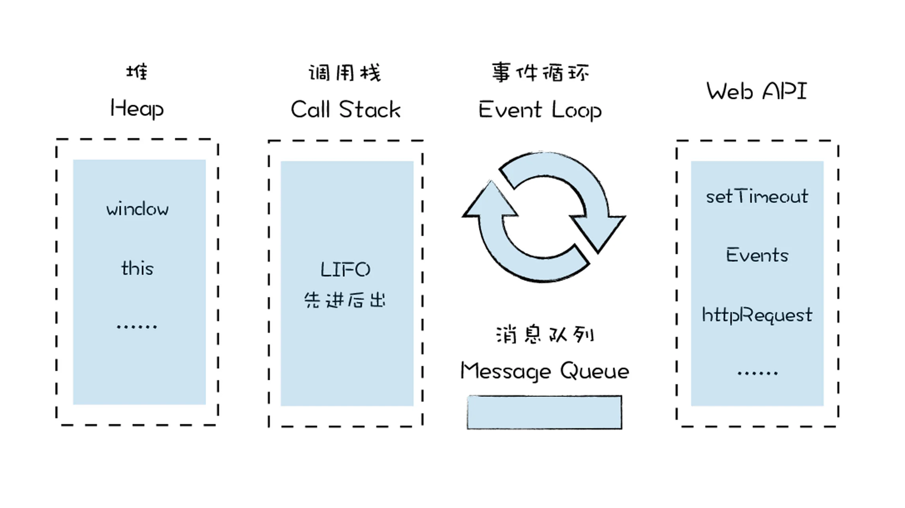
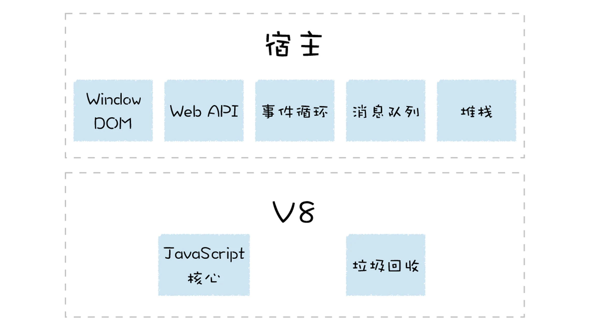
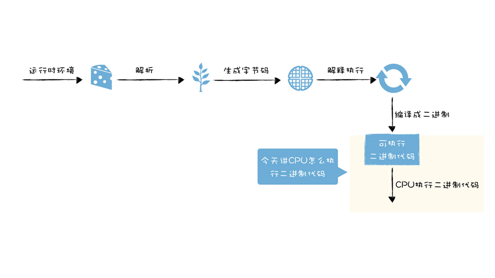
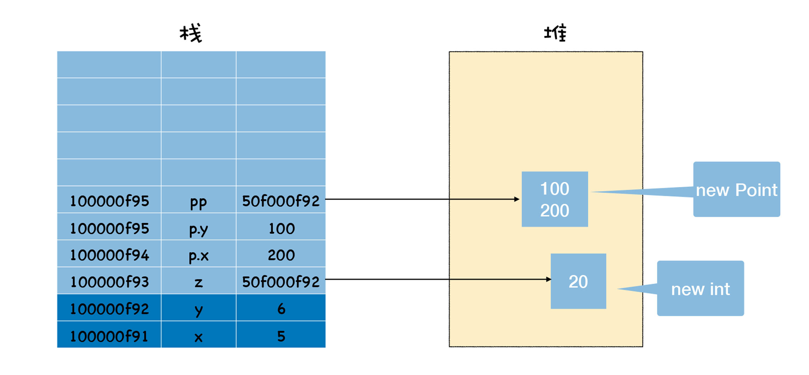
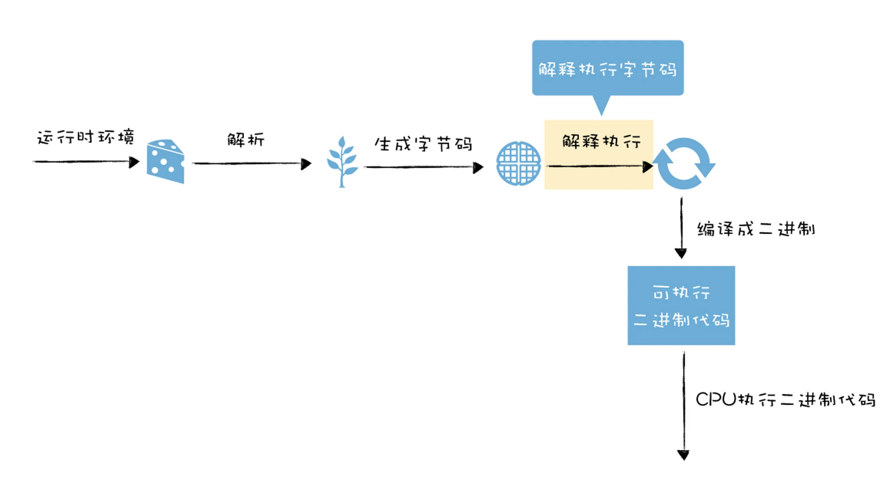

<!--
 * @Author: zhangyu
 * @Email: zhangdulin@outlook.com
 * @Date: 2022-09-21 18:51:48
 * @LastEditors: zhangyu
 * @LastEditTime: 2022-11-01 14:49:47
 * @Description: 
-->

## V8编译流水线 

### 运行时环境：运行JavaScript代码的基石





#### 栈空间堆空间
栈空间主要是用来管理 JavaScript 函数调用的，栈是内存中连续的一块空间，同时栈结构是“先进后出”的策略。在函数调用过程中，涉及到上下文相关的内容都会存放在栈上，比如原生类型、引用到的对象的地址、函数的执行状态、this 值等都会存在在栈上。当一个函数执行结束，那么该函数的执行上下文便会被销毁掉。栈空间的最大的特点是空间连续，所以在栈中每个元素的地址都是固定的，因此栈空间的查找效率非常高，
但是通常在内存中，很难分配到一块很大的连续空间，因此，V8 对栈空间的大小做了限制，如果函数调用层过深，那么 V8 就有可能抛出栈溢出的错误。你可以在控制台执行下面这样一段代码：
```js
function factorial(n){  if(n === 1) {return 1;}    return n*factorial(n-1);}console.log(factorial(50000))
```
执行这段代码，便会报出这样的错误
```js
VM68:1 Uncaught RangeError: Maximum call stack size exceeded
```
这段提示是说，调用栈超出了最大范围，因为我们这里求阶乘的函数需要嵌套调用 5 万层，而栈提供不了这么大的空间，所以就抛出了栈溢出的错误。如果有一些占用内存比较大的数据，或者不需要存储在连续空间中的数据，使用栈空间就显得不是太合适了，

所以 V8 又使用了堆空间。堆空间是一种树形的存储结构，用来存储对象类型的离散的数据，在前面的课程中我们也讲过，JavaScript 中除了原生类型的数据，其他的都是对象类型，诸如函数、数组，在浏览器中还有 window 对象、document 对象等，这些都是存在堆空间的。

宿主在启动 V8 的过程中，会同时创建堆空间和栈空间，再继续往下执行，产生的新数据都会存放在这两个空间中。
#### 构造事件循环系统
 V8 还需要有一个主线程，用来执行 JavaScript 和执行垃圾回收等工作。V8 是寄生在宿主环境中的，它并没有自己的主线程，而是使用宿主所提供的主线程，V8 所执行的代码都是在宿主的主线程上执行的。
 因为所有的任务都是运行在主线程的，在浏览器的页面中，V8 会和页面共用主线程，共用消息队列，所以如果 V8 执行一个函数过久，会影响到浏览器页面的交互性能。

### 机器代码：二进制机器码究竟是如何被CPU执行的？


涉及到了 CPU、寄存器、运算器、编译、汇编等一系列的知识。
我们从如何执行一段 C 代码讲起，由于 CPU 只能执行机器代码，所以我们需要将 C 代码转换为机器代码，这个转换过程就是由 C 编译器完成的。
CPU 执行机器代码的逻辑非常简单，首先编译之后的二进制代码被加载进内存，然后 CPU 就按照指令的顺序，一行一行地执行。在执行指令的过程中，CPU 需要对数据执行读写操作，如果直接读写内存，那么会严重影响程序的执行性能，因此 CPU 就引入了寄存器，将一些中间数据存放在寄存器中，这样就能加速 CPU 的执行速度。
有了寄存器之后，CPU 执行指令的操作就变得复杂了一点，因为需要寄存器和内存之间传输数据，或者寄存器和寄存器之间传输数据。我们通常有以下几种方式来使用寄存器，这包括了加载指令、存储指令、更新指令。通过配合这几种类型的指令，我们就可以实现完整的程序功能了。

### 堆和栈：函数调用是如何影响到内存布局的？
使用栈结构来管理函数调用
函数调用者的生命周期总是长于被调用者（后进），并且被调用者的生命周期总是先于调用者的生命周期结束 (先出)。
所以站在函数资源分配和回收角度来看，被调用函数的资源分配总是晚于调用函数 (后进)，而函数资源的释放则总是先于调用函数 (先出)。如下图所示：
通过观察函数的生命周期和函数的资源分配情况，我们发现，它们都符合后进先出 (LIFO) 的策略，而栈结构正好满足这种后进先出 (LIFO) 的需求，所以我们选择栈来管理函数调用关系是一种很自然的选择。关于栈，你可以结合这么一
#### 既然有了栈，为什么还要堆？
1. 栈的结构和非常适合函数调用过程。
2. 在栈上分配资源和销毁资源的速度非常快，这主要归结于栈空间是连续的，分配空间和销毁空间只需要移动下指针就可以了。

虽然操作速度非常快，但是栈也是有缺点的，其中最大的缺点也是它的优点所造成的，那就是栈是连续的，所以要想在内存中分配一块连续的大空间是非常难的，因此栈空间是有限的。

因为栈空间是有限的，这就导致我们在编写程序的时候，经常一不小心就会导致栈溢出，比如函数循环嵌套层次太多，或者在栈上分配的数据过大，都会导致栈溢出，基于栈不方便存放大的数据，因此我们使用了另外一种数据结构用来保存一些大数据，这就是堆。



当执行这些语句时，表示要在堆中分配一块数据，然后返回指针，通常返回的指针会被保存到栈中

### 延迟解析：V8是如何实现闭包的？
V8 的惰性解析，所谓惰性解析是指解析器在解析的过程中，如果遇到函数声明，那么会跳过函数内部的代码，并不会为其生成 AST 和字节码，而仅仅生成顶层代码的 AST 和字节码。

利用惰性解析可以加速 JavaScript 代码的启动速度，如果要将所有的代码一次性解析编译完成，那么会大大增加用户的等待时间。

由于 JavaScript 是一门天生支持闭包的语言，由于闭包会引用当前函数作用域之外的变量，所以当 V8 解析一个函数的时候，还需要判断该函数的内部函数是否引用了当前函数内部声明的变量，如果引用了，那么需要将该变量存放到堆中，即便当前函数执行结束之后，也不会释放该变量。

### V8为什么又重新引入字节码？
早期的 V8 为了提升代码的执行速度，直接将 JavaScript 源代码编译成了没有优化的二进制的机器代码，如果某一段二进制代码执行频率过高，那么 V8 会将其标记为热点代码，热点代码会被优化编译器优化，优化后的机器代码执行效率更高。
不过随着移动设备的普及，V8 团队逐渐发现将 JavaScript 源码直接编译成二进制代码存在两个致命的问题：
1. 时间问题：编译时间过久，影响代码启动速度；
2. 空间问题：缓存编译后的二进制代码占用更多的内存。
这两个问题无疑会阻碍 V8 在移动设备上的普及，于是 V8 团队大规模重构代码，引入了中间的字节码。
字节码的优势有如下三点：
1. 解决启动问题：生成字节码的时间很短；解决空间问题：
2. 字节码占用内存不多，缓存字节码会大大降低内存的使用；
3. 代码架构清晰：采用字节码，可以简化程序的复杂度，使得 V8 移植到不同的 CPU 架构平台更加容易。

### 解释器是如何解释执行字节码的？

今天V8 是如何生成字节码的，有了字节码，V8 的解释器就可以解释执行字节码了。通常有两种架构的解释器，基于栈的和基于寄存器的。基于栈的解释器会将一些中间数据存放到栈中，而基于寄存器的解释器会将一些中间数据存放到寄存器中。由于采用了不同的模式，所以字节码的指令形式是不同的。
而目前版本的 V8 是基于寄存器的，所以我们又重点分析了基于寄存器的解释器的架构，这些寄存器和 CPU 中的寄存器类似，
不过这里有一个特别的寄存器，那就是累加器。在操作过程中，一些中间结果都默认放到累加器中，比如 Ldar a1 就是将第二个参数加载到累加器中，Star r0 是将累加器中的值写入到 r0 寄存器中，Return 就是返回累加器中的数值。理解了累加器的重要性，我们又分析了一些常用字节码指令，
这包括了 Ldar、Star、Add、LdaSmi、Return，了解了这些指令是怎么工作的之后，我们就可以完整地分析一段字节码的工作流程了

### 隐藏类：如何在内存中快速查找对象属性？
最佳实践好了，现在我们知道了 V8 会为每个对象分配一个隐藏类，
在执行过程中：如果对象的形状没有发生改变，那么该对象就会一直使用该隐藏类；如果对象的形状发生了改变，那么 V8 会重建一个新的隐藏类给该对象。
我们当然希望对象中的隐藏类不要随便被改变，因为这样会触发 V8 重构该对象的隐藏类，直接影响到了程序的执行性能。
那么在实际工作中，我们应该尽量注意以下几点：
一，使用字面量初始化对象时，要保证属性的顺序是一致的。比如先通过字面量 x、y 的顺序创建了一个 point 对象，然后通过字面量 y、x 的顺序创建一个对象 point2，代码如下所示：let point = {x:100,y:200};let point2 = {y:100,x:200};虽然创建时的对象属性一样，但是它们初始化的顺序不一样，这也会导致形状不同，所以它们会有不同的隐藏类，所以我们要尽量避免这种情况。
二，尽量使用字面量一次性初始化完整对象属性。因为每次为对象添加一个属性时，V8 都会为该对象重新设置隐藏类。
三，尽量避免使用 delete 方法。delete 方法会破坏对象的形状，同样会导致 V8 为该对象重新生成新的隐藏类。
总结这节课我们介绍了 V8 中隐藏类的工作机制，
我们先分析了 V8 引入隐藏类的动机。因为 JavaScript 是一门动态语言，对象属性在执行过程中是可以被修改的，这就导致了在运行时，V8 无法知道对象的完整形状，那么当查找对象中的属性时，V8 就需要经过一系列复杂的步骤才能获取到对象属性。
为了加速查找对象属性的速度，V8 在背后为每个对象提供了一个隐藏类，隐藏类描述了该对象的具体形状。
有了隐藏类，V8 就可以根据隐藏类中描述的偏移地址获取对应的属性值，这样就省去了复杂的查找流程。不过隐藏类是建立在两个假设基础之上的：对象创建好了之后就不会添加新的属性；对象创建好了之后也不会删除属性。
一旦对象的形状发生了改变，这意味着 V8 需要为对象重建新的隐藏类，这就会带来效率问题。
为了避免一些不必要的性能问题，我们在程序中尽量不要随意改变对象的形状。我在这节课中也给你列举了几个最佳实践的策略。
最后，关于隐藏类，我们记住以下几点。
1. 在 V8 中，每个对象都有一个隐藏类，隐藏类在 V8 中又被称为 map。
2. 在 V8 中，每个对象的第一个属性的指针都指向其 map 地址。
3. map 描述了其对象的内存布局，比如对象都包括了哪些属性，这些数据对应于对象的偏移量是多少？
4. 如果添加新的属性，那么需要重新构建隐藏类。如果删除了对象中的某个属性，同样也需要构建隐藏类

###
<Gitalk />
