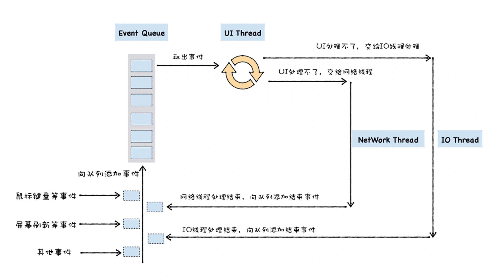
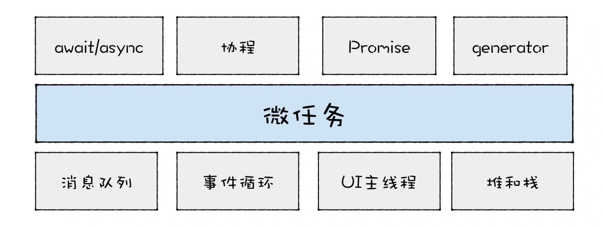
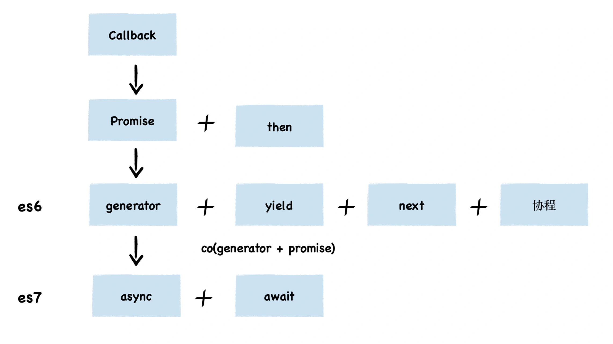
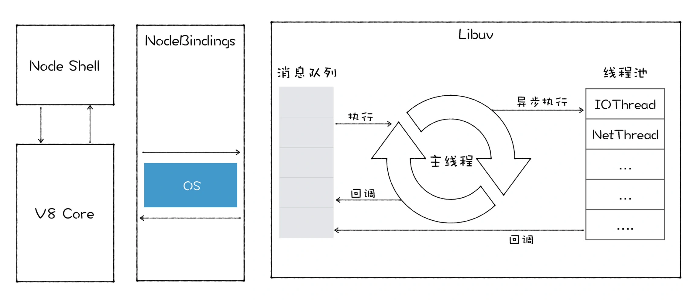

<!--
 * @Author: zhangyu
 * @Email: zhangdulin@outlook.com
 * @Date: 2022-09-21 18:51:48
 * @LastEditors: zhangyu
 * @LastEditTime: 2022-11-09 20:12:24
 * @Description: 
-->

## 时间循环和垃圾回收
### 消息队列：V8是怎么实现回调函数的？

今天我们介绍了 V8 是如何执行回调函数的。回调函数有两种类型：同步回调和异步回调，同步回调函数是在执行函数内部被执行的，

而异步回调函数是在执行函数外部被执行的。那么，搞清楚异步回调函数在什么时机被执行就非常关键了。为了理清楚这个问题，我们分析了通用 UI 线程宏观架构。UI 线程提供一个消息队列，并将待执行的事件添加到消息队列中，然后 UI 线程会不断循环地从消息队列中取出事件、执行事件。

关于异步回调，这里也有两种不同的类型，其典型代表是 setTimeout 和 XMLHttpRequest。setTimeout 的执行流程其实是比较简单的，在 setTimeout 函数内部封装回调消息，并将回调消息添加进消息队列，然后主线程从消息队列中取出回调事件，并执行回调函数。

XMLHttpRequest 稍微复杂一点，因为下载过程需要放到单独的一个线程中去执行，所以执行 XMLHttpRequest.send 的时候，宿主会将实际请求转发给网络线程，然后 send 函数退出，主线程继续执行下面的任务。网络线程在执行下载的过程中，会将一些中间信息和回调函数封装成新的消息，并将其添加进消息队列中，然后主线程从消息队列中取出回调事件，并执行回调函数。
### V8是如何实现微任务的？
基于这套基础 UI 框架，JavaScript 又延伸出很多新的技术，其中应用最广泛的当属宏任务和微任务。
宏任务很简单，就是指消息队列中的等待被主线程执行的事件。
每个宏任务在执行时，V8 都会重新创建栈，然后随着宏任务中函数调用，栈也随之变化，最终，当该宏任务执行结束时，整个栈又会被清空，接着主线程继续执行下一个宏任务。
微任务稍微复杂一点，其实你可以把微任务看成是一个需要异步执行的函数，执行时机是在主函数执行结束之后、当前宏任务结束之前。JavaScript 中之所以要引入微任务，主要是由于主线程执行消息队列中宏任务的时间颗粒度太粗了，无法胜任一些对精度和实时性要求较高的场景，那么微任务可以在实时性和效率之间做一个有效的权衡。另外使用微任务，可以改变我们现在的异步编程模型，使得我们可以使用同步形式的代码来编写异步调用。


理解微任务的执行时机，你只需要记住以下两点：
>首先，如果当前的任务中产生了一个微任务，通过 Promise.resolve() 或者 Promise.reject() 都会触发微任务，触发的微任务不会在当前的函数中被执行，所以执行微任务时，不会导致栈的无限扩张；
>其次，和异步调用不同，微任务依然会在当前任务执行结束之前被执行，这也就意味着在当前微任务执行结束之前，消息队列中的其他任务是不可能被执行的。
>不过，由于 V8 每次执行微任务时，都会退出当前 foo 函数的调用栈，所以这段代码是不会造成栈溢出的。

### V8是如何实现async/await的？
其实 async/await 技术背后的秘密就是 Promise 和生成器应用，往底层说，就是微任务和协程应用。要搞清楚 async 和 await 的工作原理，我们就得对 async 和 await 分开分析。
根据 MDN 定义，async 是一个通过异步执行并隐式返回 Promise 作为结果的函数。


### V8的两个垃圾回收器是如何工作的？
JavaScript 是一门自动垃圾回收的语言，也就是说，我们不需要去手动回收垃圾数据，这一切都交给 V8 的垃圾回收器来完成。V8 为了更高效地回收垃圾，引入了两个垃圾回收器，
目前 V8 采用了两个垃圾回收器，主垃圾回收器 -Major GC 和副垃圾回收器 -Minor GC (Scavenger)。V8 之所以使用了两个垃圾回收器，主要是受到了代际假说（The Generational Hypothesis）的影响。
代际假说是垃圾回收领域中一个重要的术语，它有以下两个特点：
>第一个是大部分对象都是“朝生夕死”的，也就是说大部分对象在内存中存活的时间很短，比如函数内部声明的变量，或者块级作用域中的变量，当函数或者代码块执行结束时，作用域中定义的变量就会被销毁。因此这一类对象一经分配内存，很快就变得不可访问；
>第二个是不死的对象，会活得更久，比如全局的 window、DOM、Web API 等对象。
其实这两个特点不仅仅适用于 JavaScript，同样适用于大多数的编程语言，如 Java、Python 等。

### V8是如何优化垃圾回收器执行效率的？
由于 JavaScript 是运行在主线程之上的，因此，一旦执行垃圾回收算法，都需要将正在执行的 JavaScript 脚本暂停下来，待垃圾回收完毕后再恢复脚本执行。我们把这种行为叫做全停顿（Stop-The-World）。

- 增量回收
谓增量式垃圾回收，是指垃圾收集器将标记工作分解为更小的块，并且穿插在主线程不同的任务之间执行。采用增量垃圾回收时，垃圾回收器没有必要一次执行完整的垃圾回收过程，每次执行的只是整个垃圾回收过程中的一小部分工作，具体流程你可以参看下图：


V8 最开始的垃圾回收器有两个特点，第一个是垃圾回收在主线程上执行，第二个特点是一次执行一个完整的垃圾回收流程。

由于这两个原因，很容易造成主线程卡顿，所以 V8 采用了很多优化执行效率的方案。
- 第一个方案是并行回收，在执行一个完整的垃圾回收过程中，垃圾回收器会使用多个辅助线程来并行执行垃圾回收。
- 第二个方案是增量式垃圾回收，垃圾回收器将标记工作分解为更小的块，并且穿插在主线程不同的任务之间执行。采用增量垃圾回收时，垃圾回收器没有必要一次执行完整的垃圾回收过程，每次执行的只是整个垃圾回收过程中的一小部分工作。
- 第三个方案是并发回收，回收线程在执行 JavaScript 的过程，辅助线程能够在后台完成的执行垃圾回收的操作。主垃圾回收器就综合采用了所有的方案，副垃圾回收器也采用了部分方案

### 几种常见内存问题的解决策略
Node 的体系架构

内存问题至关重要，因为通过内存而造成的问题很容易被用户察觉。总的来说，内存问题可以定义为下面这三类：
- 内存泄漏 (Memory leak)，它会导致页面的性能越来越差；
- 内存膨胀 (Memory bloat)，它会导致页面的性能会一直很差；
- 频繁垃圾回收，它会导致页面出现延迟或者经常暂停。

优化防止内存泄露
```js
function foo(){  
    var temp_object = new Object()
    temp_object.x = 1
    temp_object.y = 2
    temp_object.array = new Array(200000)
    /**
    *   使用temp_object
    */
   let closure = temp_object.x
    return function(){
        console.log(closure);
    }
}
```
> 内存膨胀和内存泄漏有一些差异，内存膨胀主要表现在程序员对内存管理的不科学，比如只需要 50M 内存就可以搞定的，有些程序员却花费了 500M 内存。额外使用过多的内存有可能是没有充分地利用好缓存，也有可能加载了一些不必要的资源。通常表现为内存在某一段时间内快速增长，然后达到一个平稳的峰值继续运行。

>频繁使用大的临时变量，导致了新生代空间很快被装满，从而频繁触发垃圾回收。频繁的垃圾回收操作会让你感觉到页面卡顿。比如下面这段代码：
```js

function strToArray(str) {
  let i = 0
  const len = str.length
  let arr = new Uint16Array(str.length)
  for (; i < len; ++i) {
    arr[i] = str.charCodeAt(i)
  }
  return arr;
}


function foo() {
  let i = 0
  let str = 'test V8 GC'
  while (i++ < 1e5) {
    strToArray(str);
  }
}


foo()
```
<Gitalk />

