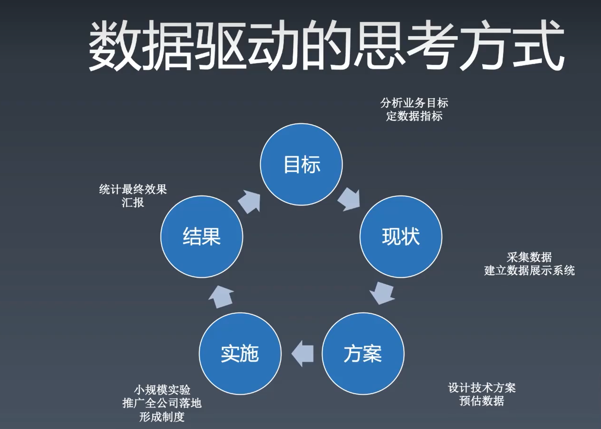

<!--
 * @Author: zhangyu
 * @Email: zhangdulin@outlook.com
 * @Date: 2022-08-09 15:57:07
 * @LastEditors: zhangyu
 * @LastEditTime: 2022-11-14 14:11:38
 * @Description: 
-->
## 重学工程体系

### 构建思维导图

### 优秀的前端工程师

领域知识
能力 潜力 成就
职业规划

### 职业发展

成就 晋升 成长

业务形成就
工程型成就
技术难题

业务形成就

业务目标：理解公司业务的核心目标，目标转化为指标
技术方案：业务指标到技术指标的转化，形成纸面方案，完成小规模实验
实施方案：确定实施目标，参与人，管理实施进度
结果评估：数据采集，数据报表，向上级汇报

技术难题
目标：公认的技术难点
方案与实施：依靠扎实的编程能力，架构能力形成解决方案
结果： 问题解决

工程型成就
目标：质量效率
方案与实施： 规章制度。库，工具，系统
结果：线上监控

### 数据驱动的思考方式

### 工具链

1. 工具链的作用
2. 工具链的分类
   > 脚手架
   > 本地调试
   > 单元测试
   > 发布
3. 工具链体系的设计
   > 版本问题
   > 数据统计

init run test publish

### 持续集成

客户端软件持续集成
daily build
bvt

前端持续集成
check in build
lint rule check

### 技术架构

客户端：解决软件需求规模带来的复杂性
服务端：解决大量用户访问带来的复杂性
前端架构：解决大量页面需求带来的重复劳动问题

库：有服用价值的代码
url ajax env
组件：ui 上多次出现的元素 组件的定义和基础设施，就是组件化方案
轮播 tab
模块：经常被使用的业务区块
登录

 <Gitalk />
