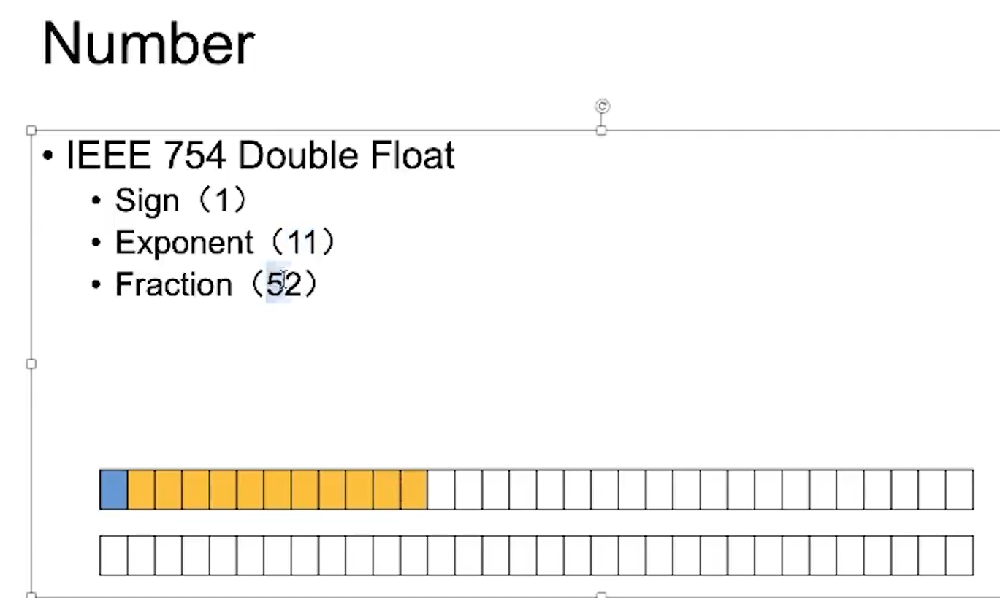
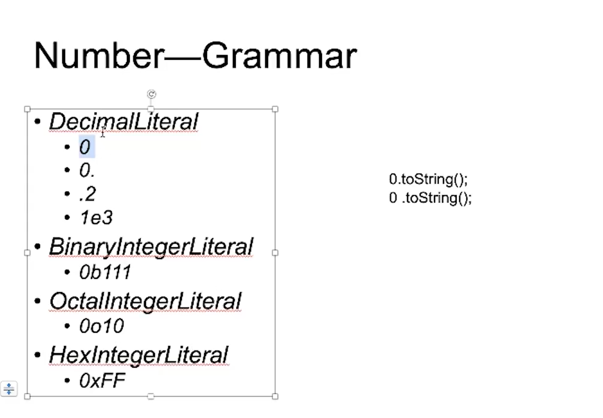
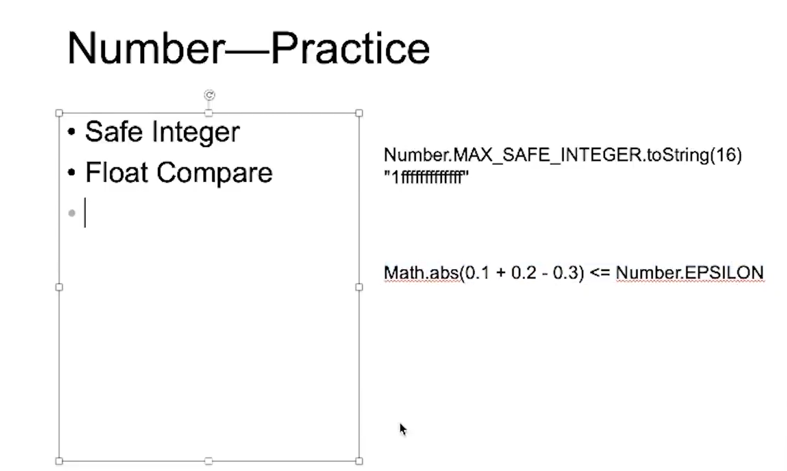
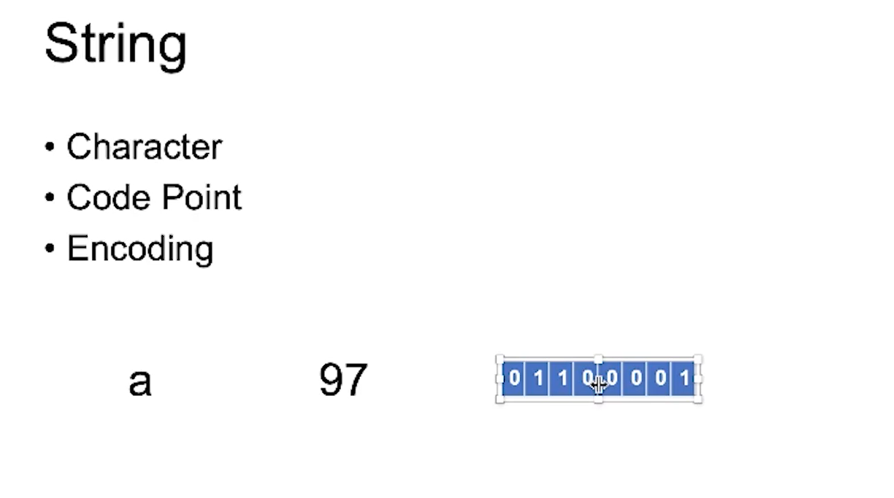
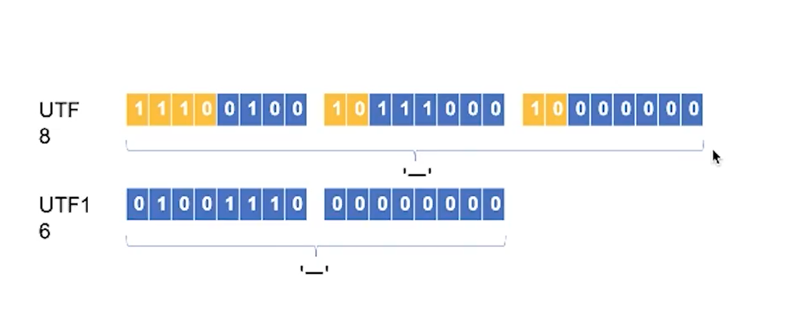
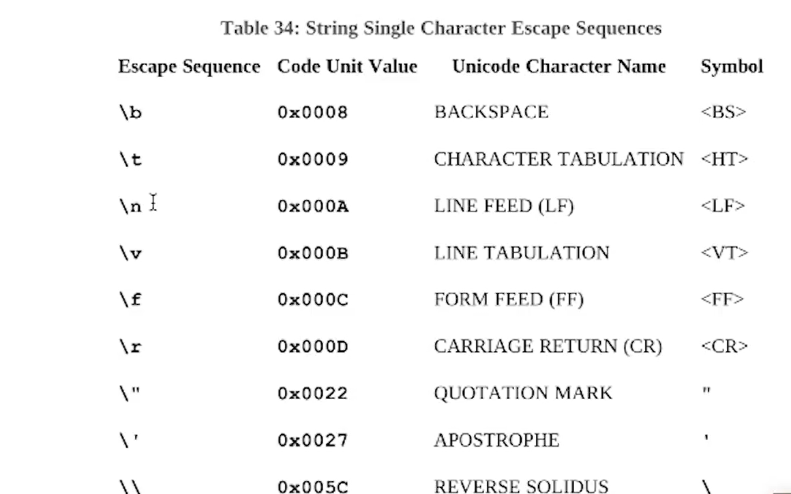

## 重学javaScript词法，类型

原子
Atom:
Identifier
Literal

表达式
Expression:
Atome
Operator
Punctuator

语句
Statement:
Expression
Keyword
Punctuator

结构化
Structure:
Function
Class
Process
Namespace

程序集
Program:
Program
Module
Package
Library

###  A Grammar Summary
SourceCharacter ::
any Unicode code point

unicode: https://home.unicode.org/
fileformat: https://www.fileformat.info/

for(let i=0;i<128;i++>) {
    console.log(String.fromCharCode(i))
}

String.formCodePoint
.codePointAt
'1'.codePointAt(0).toString(16)        

### InputElement
WhiteSpace 空格
LineTerminator 换行
Comment 注释
CommonToken token 有意思的输入
DivPunctuator
RightBracePunctuator

#### WhiteSpace 
``` js
<TAB> tab 制表符
<VT> 11 纵向制表符 "\v"
<FF> 10 
<SP> 32 普通空格
<NBSP> U + 00A0 空格 NO-BREAK SPACE 主要处理排版 使之连接不断
<ZWNBSP> ZERO WIDTH NO-BREAK SPACE
<USP>
``` 

#### LineTerminator 
``` js
<LF> U+000A
<CR> U+000D
<LS> U+2028     LINE SEPARATOR
<PS> U+2029  PARAGRAPH SEPARATOR
``` 
#### token
IdentifierName 标识符:变量a， document等 关键字：for let
    Identifier
    Keywords
    Future reserved Keywords 将来会用 例如：enum
PrivateIdentifier
Punctuator 符号：< > ()
Literal Number String Boolean Object Null undefined Symbol
    NumericLiteral
    StringLiteral
Template


#### Literal

##### Number


var a = 0.1
var b = 0.2

const intarray = new Uint8Array(8);
const memory = new Float64Array(intarray.buffer);
intarray[0] = 0b00000000
intarray[1] = 0b00000100 


for (let i =0; i<8; i++>) {
    let s = (intarray[i].toString(2))
    console.log(s)
}
console.log(memory)
console.log(intarray)


<!-- const memory = new Int8Array(8);
typedArray1[0] = 32; -->
<!-- 
const typedArray2 = new Int8Array(typedArray1);
typedArray2[1] = 42; -->
Number grammar


0b八进制
0x 16进制

paseInt('10', 2)


Number Practice



##### String



97 .toString(2) 带空格是使 97 编程字符
1100001

字符集
. ASCLL
. Unicode
. UCS U+0000-U+FFFF
. GB 国标
    .GB2312
    .GBK(GB13000)
    .GB18030
. ISO-8859
. BIG5


Encoding
UTF



function UTF8_Encoding(string) {
    return new Buffer
}


Grammer
"abc"
'abc'
`abc`
\
"\x10"
"\u1000"
"\\"
"\b" (f,n,r,t,v)



 <Gitalk />