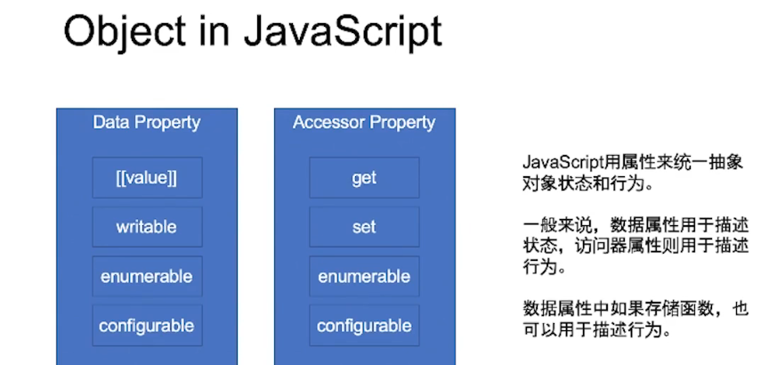

## 重学javaScript语句 对象

### block
BlockStatement 
{
  ...
}

### Completion Record
[[type]]:normal,break,continue,return,or throw
[[value]]: Types
[[target]]:label
 
normal 语句：const let 
非normal语句： return 

### 简单语句
ExpressionStatement
EmptyStatement
DebuggerStatement
throwStatement
ContinueStatement
BreakStatement
ReturnStatement

### Iteration
while ; do while ; for ;for in; for of: 任何可以迭代的都可以用;
var; const/let ;in;
for await
 
### 标签，循环，break,continue
LabelledStatement 
IterationStatement 
ContinueStatement
BreakStatement
SwitchStatement
[[type]]:break,contunue
[[value]]: --
[[target]]:label

### try
try {

} catch(e){

}finally {

}

### 声明
FunctionDeclaration
GenaratorDeclaration
AsyncFunctionDeclaration
AsyncGenaratorDeclaration
VariableDeclaration
ClassDeclaration
LexicalDeclaration

function* foo() {
  yield 1
  var i =2
  while (true) {
    yeild i++
  }
}
foo.next()

function sleep(t) {
  return new Promise(resolve=>setTimeout(resolve, t))
}
void async function() {
  var 1= 0
  while(true) {
    i++
    await sleep(1000)
  }
}()

实现无限数字
async function* foo() {
  var 1= 0
  while(true) {
    i++
    await sleep(1000)
  }
}
void async function() {
var g = foo()
for await (let e of g) {
  console.log(e)
}
}()

### object 面向对象
我们不应该收到语言描述的干扰
在设计对象的状态和行为时，我们总是遵循“行为改变状态”的原则

在js中运行时，我们只关心原型和属性

object api
{} .  Object.defineProperty
Object.create  Object.setPrototypeOf Object.getPrototypeOf
new classs  extends
new function prototype
 
 <Gitalk />