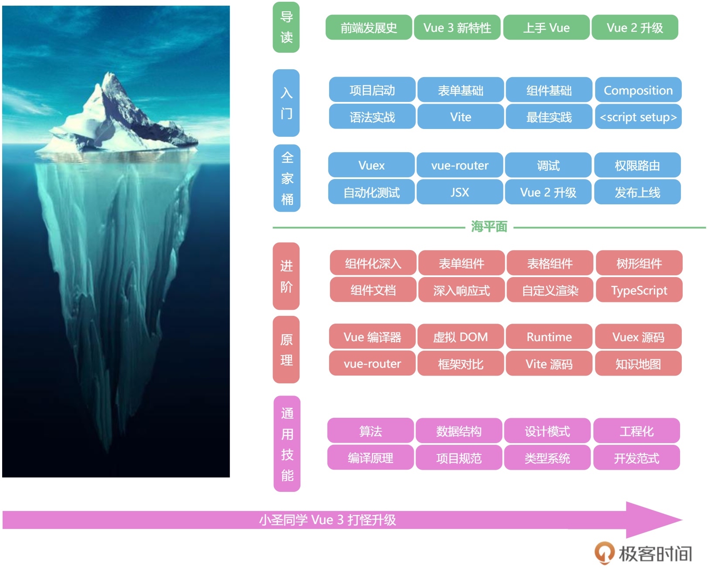

<!--
 * @Author: zhangyu
 * @Email: zhangdulin@outlook.com
 * @Date: 2022-09-21 18:51:48
 * @LastEditors: zhangyu
 * @LastEditTime: 2023-02-20 15:49:59
 * @Description: 
-->

## 玩转 Vue 3 全家桶

- [开篇词 | 如何借助Vue 3建构你的前端知识体系？](./list/p1.md)
- [课程导读](./list/p2.md)
- [基础篇](./list/p3.md)
- [全家桶实战篇](./list/p4.md)
- [加餐：好项目和ts]](./list/p5.md)
- [进阶](./list/p6.md)
- [生态源码-响应式系统](./list/p7.md)
- [运行时：Vue在浏览器里是怎么跑起来的](./list/p8.md)
- [虚拟DOM（上）：如何通过虚拟DOM更新页面？](./list/p9.md)
- [Vue 3 Compiler](./list/p10.md)

<Gitalk />
