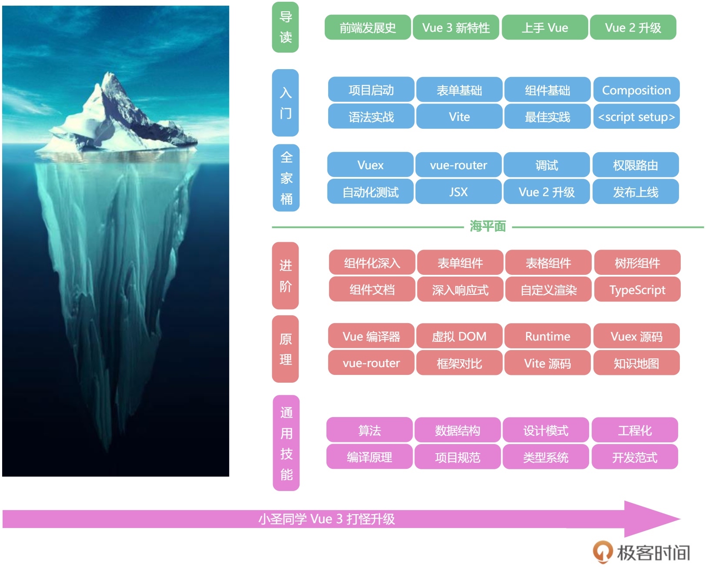

<!--
 * @Author: zhangyu
 * @Email: zhangdulin@outlook.com
 * @Date: 2022-09-21 18:51:48
 * @LastEditors: zhangyu
 * @LastEditTime: 2022-12-06 20:16:36
 * @Description: 
-->

## 玩转 Vue 3 全家桶

- [开篇词 | 如何借助Vue 3建构你的前端知识体系？](./list/p1.md)
- [课程导读](./list/p2.md)
- [基础篇](./list/p3.md)
- [全家桶实战篇](./list/p4.md)
- [时间循环和垃圾回收](./list/p5.md)
- [something](./list/p6.md)

<Gitalk />
