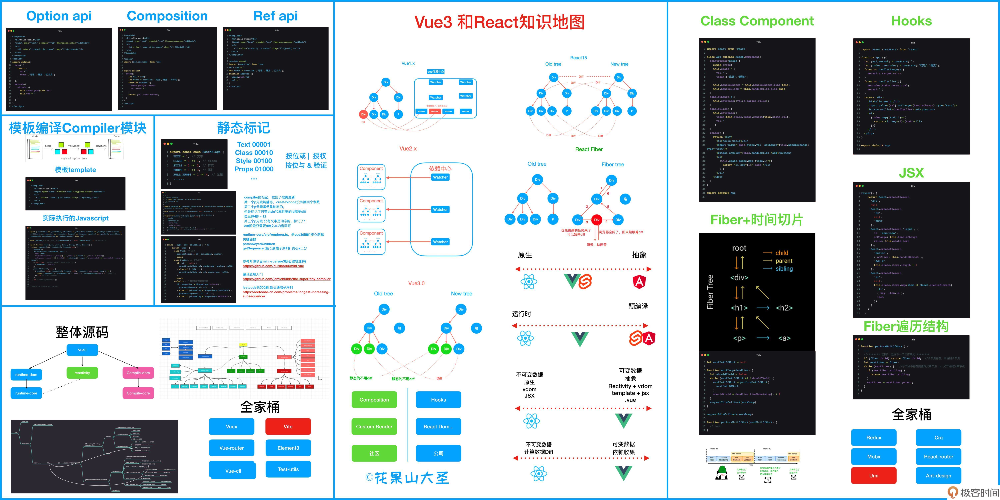

<!--
 * @Author: zhangyu
 * @Email: zhangdulin@outlook.com
 * @Date: 2022-09-21 18:51:48
 * @LastEditors: zhangyu
 * @LastEditTime: 2022-11-29 15:37:21
 * @Description: 
-->

## 开篇词 | 如何借助Vue 3建构你的前端知识体系？

说白了，能坚持读完《算法导论》的人太少了，但是大部分人都可以很开心地玩王者荣耀。王者也是一个很复杂的游戏，但它给了玩家一个渐进式的学习机制。所以，这个专栏也会提供给你一条渐进式打怪升级的学习之路。

在目前的前端开发中，流行的框架相信你并不陌生。它们的目标都是为了帮助开发者高效地开发 Web 应用，只不过走的路线略显不同，

比如 React 注重数据不可变、虚拟 DOM 和运行时；而 Svelte 运行时都非常轻量级，侧重在于编译时的优化；Angular 则在抽象这个维度又走向一个极致，生来就是为了复杂项目。每个流行框架的内部，都有一大堆的最佳实践。

而相比之下，Vue 就简单多了，简单到大部分前端开发者都能学得会。Vue 在每个维度之间，做了非常好的权衡和取舍，算是一个非常中庸且优雅的框架，兼顾响应式、虚拟 DOM、运行时和编译优化。

<Gitalk />
