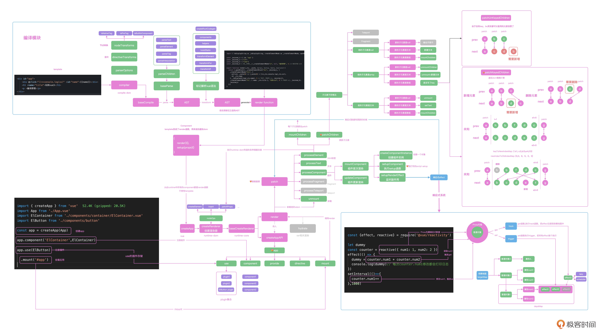

<!--
 * @Author: zhangyu
 * @Email: zhangdulin@outlook.com
 * @Date: 2022-09-21 18:51:48
 * @LastEditors: zhangyu
 * @LastEditTime: 2023-03-25 16:28:26
 * @Description: 
-->

## 32｜编译原理（上）：手写一个迷你Vue 3 Compiler的入门原理

编译原理也属于计算机中的一个重要学科，Vue 的 compiler 是在 Vue 场景下的实现，目的就是实现 template 到 render 函数的转变。

在线编译例子
https://vue-next-template-explorer.netlify.app/#%7B%22src%22%3A%22%3Cdiv%20id%3D%5C%22app%5C%22%3E%5Cn%20%20%20%20%3Cdiv%20%40click%3D%5C%22()%3D%3Econsole.log(xx)%5C%22%20%3Aid%3D%5C%22name%5C%22%3E%7B%7Bname%7D%7D%3C%2Fdiv%3E%5Cn%20%20%20%20%3Ch1%20%3Aname%3D%5C%22title%5C%22%3E%E7%8E%A9%E8%BD%ACvue3%3C%2Fh1%3E%5Cn%20%20%20%20%3Cp%20%3E%E7%BC%96%E8%AF%91%E5%8E%9F%E7%90%86%3C%2Fp%3E%5Cn%3C%2Fdiv%3E%5Cn%22%2C%22ssr%22%3Afalse%2C%22options%22%3A%7B%22mode%22%3A%22module%22%2C%22filename%22%3A%22Foo.vue%22%2C%22prefixIdentifiers%22%3Afalse%2C%22hoistStatic%22%3Atrue%2C%22cacheHandlers%22%3Atrue%2C%22scopeId%22%3Anull%2C%22inline%22%3Afalse%2C%22ssrCssVars%22%3A%22%7B%20color%20%7D%22%2C%22compatConfig%22%3A%7B%22MODE%22%3A3%7D%2C%22whitespace%22%3A%22condense%22%2C%22bindingMetadata%22%3A%7B%22TestComponent%22%3A%22setup-const%22%2C%22setupRef%22%3A%22setup-ref%22%2C%22setupConst%22%3A%22setup-const%22%2C%22setupLet%22%3A%22setup-let%22%2C%22setupMaybeRef%22%3A%22setup-maybe-ref%22%2C%22setupProp%22%3A%22props%22%2C%22vMySetupDir%22%3A%22setup-const%22%7D%2C%22optimizeBindings%22%3Afalse%7D%7D


```js

function compiler(template) {
  const ast = parse(template);
  transform(ast)

  const code = generate(ast)
  return code
}

let template = `<div id="app">
  <div @click="()=>console.log(xx)" :id="name">{{name}}</div>
  <h1 :name="title">玩转vue3</h1>
  <p >编译原理</p>
</div>
`

const renderFunction = compiler(template)
console.log(renderFunction)

// 下面是输出结果
import { openBlock as _openBlock, createVnode as _createVnode, createBlock as _createBlock, toDisplayString as _toDisplayString } from 'vue'

export function render(_ctx, _cache, $props) {
  return (_openBlock(), _createVnode("div", { id: "app" }), [
    _createVnode("div", { onClick: "()=>console.log(xx)", id: "name" }), [
      _toDisplayString(_ctx.name)
    ], 24, _createVnode("h1", { name: "title" }), [
      "玩转vue3"
    ], 8, _createVnode("p", {}), [
      "编译原理"
    ], 0
  ], 0)
}

```
tokenizer 可以用来做语句分析，而 parse 负责生成抽象语法树 AST。然后我们一起分析 AST 中的 Vue 语法，最后通过 generate 函数生成最终的代码。

通过这个迷你的 compiler，我们学习了编译原理的入门知识：包括 parser 的实现、AST 是什么，AST 的语义化优化和代码生成 generate 模块，这给我们下一讲弄清楚 Vue 的 compiler 的核心逻辑打下了良好的理论基础。

我想提醒你注意一个优化方法，我们实现的迷你 compiler 也实现了属性的静态标记，通过在编译期间的标记方式，让虚拟 DOM 在运行时有更多的状态，从而能够精确地控制更新。这种编译时的优化也能够对我们项目开发有很多指引作用，我会在剖析完 Vue 的 compiler 之后，在第 34 讲那里跟你分享一下实战中如何使用编译优化的思想。

### 33 | 编译原理（中）：Vue Compiler模块全解析
Vue 3 内部有 4 个和 compiler 相关的包。compiler-dom 和 compiler-core 负责实现浏览器端的编译，这两个包是我们需要深入研究的，compiler-ssr 负责服务器端渲染，我们后面讲 ssr 的时候再研究，compiler-sfc 是编译.vue 单文件组件的，有兴趣的同学可以自行探索。

github
https://github.com/vuejs/vue-next/blob/master/packages/compiler-dom/src/index.ts#L40

编译原理的基础知识。通过实现这个迷你 Vue compiler，我们知道了 tokenizer 可以用来做语句分析，而 parse 负责生成抽象语法树 AST。然后我们一起分析 AST 中的 Vue 语法，最后通过 generate 函数生成最终的代码。
Vue 3 内部有 4 个和 compiler 相关的包。compiler-dom 和 compiler-core 负责实现浏览器端的编译，这两个包是我们需要深入研究的，compiler-ssr 负责服务器端渲染，我们后面讲 ssr 的时候再研究，compiler-sfc 是编译.vue 单文件组件的，有兴趣的同学可以自行探索。

今天我们一起分析了 Vue 中的 compiler 执行全流程，有了上一讲编译入门知识的基础之后，今天的 parse，transform 和 generate 模块就是在上一讲的基础之上，更加全面地实现代码的编译和转化。上面的流程图中，我们代码中的 template 是通过 compiler 函数进行编译转换，compiler 内部调用了 compiler-core 中的 baseCompile 函数，并且传递了浏览器平台的转换逻辑。比如 isNativeTag 等函数，baseCompie 函数中首先通过 baseParse 函数把 template 处理成为 AST，并且由 transform 函数进行标记优化，transfom 内部的 transformIf，transformOn 等函数会对 Vue 中的语法进行标记，这样在 generate 函数中就可以使用优化后的 AST 去生成最终的 render 函数。

最终，render 函数会和我们写的 setup 函数一起组成组件对象，交给页面进行渲染。
后面我特意为你绘制了一幅 Vue 全流程的架构图，你可以保存下来随时查阅。



### 34 | 编译原理（下）：编译原理给我们带来了什么？
我们把 Vue 内部的 compiler 原理融会贯通之后，今天尝试把 template 到 render 转化过程的思想应用到实际项目中。Vue 中的 compiler 在转化的过程中还做了静态标记的优化，我们在实际开发中可以借鉴编译的思路，提高开发的效率。

我们一起回顾一下代码自动导入的操作思路。首先我们可以实现页面中 ref、computed 的 API 的自动化导入，在 vite 插件的 transform 函数中获取到待转换的代码，通过对代码的内容进行正则匹配，实现如果出现了 ref，computed 等函数的调用，我们可以把这些依赖的函数收集在 helper 中。最终在 script setup 标签之前新增 import 语句来导入依赖的 API，最终就可以实现代码的自动导入。

实际开发中，我们可以把使用到的组件库 Element3，工具函数 vueuse 等框架都进行语法的解析，实现函数和组件的自动化导入和按需加载。这样能在提高开发效率的同时，也提高我们书写 vite 插件的能力。思考题

### 35｜Vite原理：写一个迷你的Vite

webpack 的核心原理就是通过分析 JavaScript 中的 require 语句，分析出当前 JavaScript 文件所有的依赖文件，然后递归分析之后，就得到了整个项目的一个依赖图。对图中不同格式的文件执行不同的 loader，比如会把 CSS 文件解析成加载 CSS 标签的 JavaScript 代码，最后基于这个依赖图获取所有的文件。

进行打包处理之后，放在内存中提供给浏览器使用，然后 dev-server 会启动一个测试服务器打开页面，并且在代码文件修改之后可以通过 WebSocket 通知前端自动更新页面，也就是我们熟悉的热更新功能。

由于 webpack 在项目调试之前，要把所有文件的依赖关系收集完，打包处理后才能启动测试，很多大项目我们执行调试命令后需要等 1 分钟以上才能开始调试。这对于开发者来说，这段时间除了摸鱼什么都干不了，而且热更新也需要等几秒钟才能生效，极大地影响了我们开发的效率。所以针对 webpack 这种打包 bundle 的思路，社区就诞生了 bundless 的框架，Vite 就是其中的佼佼者。

```js

const fs = require('fs')
const path = require('path')
const Koa = require('koa')
const app = new Koa()

function rewriteImport(content){
  return content.replace(/ from ['|"]([^'"]+)['|"]/g, function(s0,s1){
    // . ../ /开头的，都是相对路径
    if(s1[0]!=='.'&& s1[1]!=='/'){
      return ` from '/@modules/${s1}'`
    }else{
      return s0
    }
  })
}

app.use(async ctx=>{
  const {request:{url,query} } = ctx
  if(url=='/'){
      ctx.type="text/html"
      let content = fs.readFileSync('./index.html','utf-8')
      
      ctx.body = content
  }else if(url.endsWith('.js')){
    // js文件
    const p = path.resolve(__dirname,url.slice(1))
    ctx.type = 'application/javascript'
    const content = fs.readFileSync(p,'utf-8')
    ctx.body = rewriteImport(content)
  } else if(url.startsWith('/@modules/')){
    // 这是一个node_module里的东西
    const prefix = path.resolve(__dirname,'node_modules',url.replace('/@modules/',''))
    const module = require(prefix+'/package.json').module
    const p = path.resolve(prefix,module)
    const ret = fs.readFileSync(p,'utf-8')
    ctx.type = 'application/javascript'
    ctx.body = rewriteImport(ret)
}
})
app.listen(24678, ()=>{
  console.log('快来快来说一书，端口24678')
})


const compilerSfc = require('@vue/compiler-sfc') // .vue
const compilerDom = require('@vue/compiler-dom') // 模板


if(url.indexOf('.vue')>-1){
    // vue单文件组件
    const p = path.resolve(__dirname, url.split('?')[0].slice(1))
    const {descriptor} = compilerSfc.parse(fs.readFileSync(p,'utf-8'))

    if(!query.type){
      ctx.type = 'application/javascript'
      // 借用vue自导的compile框架 解析单文件组件，其实相当于vue-loader做的事情
      ctx.body = `
  ${rewriteImport(descriptor.script.content.replace('export default ','const __script = '))}
  import { render as __render } from "${url}?type=template"
  __script.render = __render
  export default __script
      `
    }else if(query.type==='template'){
      // 模板内容
      const template = descriptor.template
      // 要在server端吧compiler做了
      const render = compilerDom.compile(template.content, {mode:"module"}).code
      ctx.type = 'application/javascript'

      ctx.body = rewriteImport(render)
    }
    

    
if(url.endsWith('.css')){
    const p = path.resolve(__dirname,url.slice(1))
    const file = fs.readFileSync(p,'utf-8')
    const content = `
    const css = "${file.replace(/\n/g,'')}"
    let link = document.createElement('style')
    link.setAttribute('type', 'text/css')
    document.head.appendChild(link)
    link.innerHTML = css
    export default css
    `
    ctx.type = 'application/javascript'
    ctx.body = content
  }

  

export function watch() {
  const watcher = chokidar.watch(appRoot, {
    ignored: ['**/node_modules/**', '**/.git/**'],
    ignoreInitial: true,
    ignorePermissionErrors: true,
    disableGlobbing: true,
  });
  watcher;

  return watcher;
}
export function handleHMRUpdate(opts: { file: string; ws: any }) {
  const { file, ws } = opts;
  const shortFile = getShortName(file, appRoot);
  const timestamp = Date.now();

  console.log(`[file change] ${chalk.dim(shortFile)}`);
  let updates;
  if (shortFile.endsWith('.css')) {
    updates = [
      {
        type: 'js-update',
        timestamp,
        path: `/${shortFile}`,
        acceptedPath: `/${shortFile}`,
      },
    ];
  }

  ws.send({
    type: 'update',
    updates,
  });
}


async function handleMessage(payload: any) {
  switch (payload.type) {
    case 'connected':
      console.log(`[vite] connected.`);

      setInterval(() => socket.send('ping'), 30000);
      break;

    case 'update':
      payload.updates.forEach((update: Update) => {
        if (update.type === 'js-update') {
          fetchUpdate(update);
        } 
      });
      break;
  }
}

```

webpack 启动服务器之前需要进行项目的打包，而 Vite 则是可以直接启动服务，通过浏览器运行时的请求拦截，实现首页文件的按需加载，这样开发服务器启动的时间就和整个项目的复杂度解耦。任何时候我们启动 Vite 的调试服务器，基本都可以在一秒以内响应，这极大地提升了开发者的体验，这也是 Vite 的使用率越来越高的原因。

并且我们可以看到，Vite 的主要目的就是提供一个调试服务器。Vite 也可以和 Vue 解耦，实现对任何框架的支持，如果使用 Vite 支持 React，只需要解析 React 中的 JSX 就可以实现。

这也是 Vite 项目的现状，我们只需要使用框架对应的 Vite 插件就可以支持任意框架。Vite 能够做到这么快的原因，还有一部分是因为使用了 esbuild 去解析 JavaScript 文件。esbuild 是一个用 Go 语言实现的 JavaScript 打包器，支持 JavaScript 和 TypeScript 语法，现在前端工程化领域的工具也越来越多地使用 Go 和 Rust 等更高效的语言书写，这也是性能优化的一个方向。

### 36｜数据流原理：Vuex & Pinia源码剖析
Pinia 就是 Vuex5 提案产出的框架，现在已经是 Vue 官方的框架了，也就是 Vuex5 的实现。在 Pinia 的代码中，我们通过 createPinia 创建 Pinia 实例，并且可以通过 Option 和 Composition 两种风格的 API 去创建 store，返回 useStore 函数获取 Pinia 的实例后，就可以进行数据的修改和读取。

### 37 前端路由原理：vue-router源码剖析
首先我们分析了 createRouter 函数入口函数，createRouter 函数返回了 router 对象，router 对象提供了 addRoute、push 等方法，并且在 install 方法中实现了路由，注册了组件 router-link 和 router-view。

然后通过 createRouterMatcher 创建路由匹配对象，并且在路由变化的时候维护 currentRoute，让你可以在每个组件内部 router和route 获取路由匹配的数据，并且动态渲染当前路由匹配的组件到 router-view 组件内部，实现了前端的路由系统。这一讲我们也能感受到，一个玩具的 router 和实际的 vue-router 的距离，也能体会到 TypeScript 在我们阅读代码时的好处。

我们阅读源码的目的之一，就是要学习和模仿优秀框架内部的设计思路，然后去优化自己项目中的代码，学会模仿也是一个优秀程序员的优秀品质。

### 38｜服务端渲染原理：Vue 3中的SSR是如何实现的？
Vue SSR 源码剖析

在 CSR 环境下，template 解析的 render 函数用来返回组件的虚拟 DOM，而 SSR 环境下 template 解析的 ssrRender 函数，函数内部是通过 _push 对字符串进行拼接，最终生成组件渲染的结果的。你可以在官方的模板渲染演示页面选择 ssr 设置后，看到渲染的结果：

通过 compiler-ssr 模块把 template 解析成 ssrRender 函数后，整个组件通过 renderToString 把组件渲染成字符串返回给浏览器。SSR 最终实现了通过服务器端解析 Vue 组件的方式，提高首屏的响应时间和页面的 SEO 友好度。同构应用和其他

每个技术架构的出现都是为了解决一些特定的问题，但是它们的出现也必然会带来新的问题。

今年还出现了在浏览器里跑 node 的webcontainer技术，如果这个技术成熟后，我们甚至可以把 Express、Egg.js 等后端应用也部署到 CDN 节点上，在浏览器端实现服务器应用的 ESR，一起期待 webcontainer 技术的发展。

```js

export const createApp = ((...args) => {
  const app = ensureRenderer().createApp(...args)
  const { mount } = app
  // 重写mount
  app.mount = (containerOrSelector: Element | ShadowRoot | string): any => {
    const container = normalizeContainer(containerOrSelector)
    if (!container) return

    const component = app._component
    if (!isFunction(component) && !component.render && !component.template) {
      component.template = container.innerHTML
    }
    container.innerHTML = ''
    const proxy = mount(container, false, container instanceof SVGElement)
    if (container instanceof Element) {
      container.removeAttribute('v-cloak')
      container.setAttribute('data-v-app', '')
    }
    return proxy
  }
  return app
}) 
function normalizeContainer(container){
  if (isString(container)) {
    const res = document.querySelector(container)
  }
  return container
}
```

我真正想传达的理念是，任何框架，我们都可以通过深入底层，在理解框架底层用到的计算机世界最佳实践的基础上，去构建自己的知识体系。如果只是浮于表层，只是追求框架的使用层面，是无法构建自己核心竞争力的。


<Gitalk />
