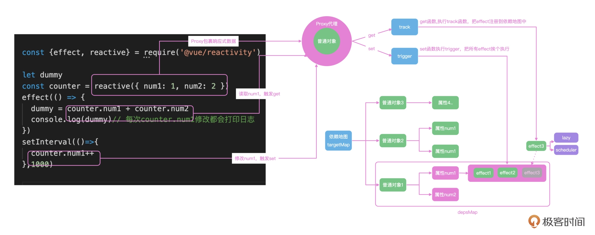

<!--
 * @Author: zhangyu
 * @Email: zhangdulin@outlook.com
 * @Date: 2022-09-21 18:51:48
 * @LastEditors: zhangyu
 * @LastEditTime: 2023-02-20 15:17:40
 * @Description: 
-->

## 28｜响应式：万能的面试题，怎么手写响应式系统
响应式机制的主要功能就是，可以把普通的 JavaScript 对象封装成为响应式对象，拦截数据的获取和修改操作，实现依赖数据的自动化更新。



```js

export function reactive(target) {
  if (typeof target!=='object') {
    console.warn(`reactive  ${target} 必须是一个对象`);
    return target
  }

  return new Proxy(target, mutableHandlers);
}


const get = createGetter();
const set = createSetter();

function createGetter(shallow = false) {
  return function get(target, key, receiver) {
    const res = Reflect.get(target, key, receiver)
    track(target, "get", key)
    if (isObject(res)) {
      // 值也是对象的话，需要嵌套调用reactive
      // res就是target[key]
      // 浅层代理，不需要嵌套
      return shallow ? res : reactive(res)
    }
    return res
  }
}

function createSetter() {
  return function set(target, key, value, receiver) {
    const result = Reflect.set(target, key, value, receiver)
    // 在触发 set 的时候进行触发依赖
    trigger(target, "set", key)
    return result
  }
}
export const mutableHandles = {
  get,
  set,
};

```
### track

在 track 函数中，我们可以使用一个巨大的 tragetMap 去存储依赖关系。map 的 key 是我们要代理的 target 对象，值还是一个 depsMap，存储这每一个 key 依赖的函数，每一个 key 都可以依赖多个 effect。上面的代码执行完成，depsMap 中就有了 num1 和 num2 两个依赖。

有了大的设计思路，我们来进行具体的实现，在 reactive 下新建 effect.js。由于 target 是对象，所以必须得用 map 才可以把 target 作为 key 来管理数据，每次操作之前需要做非空的判断。最终把 activeEffect 存储在集合之中：
```js

const targetMap = new WeakMap()

export function track(target, type, key) {

  // console.log(`触发 track -> target: ${target} type:${type} key:${key}`)

  // 1. 先基于 target 找到对应的 dep
  // 如果是第一次的话，那么就需要初始化
  // {
  //   target1: {//depsmap
  //     key:[effect1,effect2]
  //   }
  // }
  let depsMap = targetMap.get(target)
  if (!depsMap) {
    // 初始化 depsMap 的逻辑
    // depsMap = new Map()
    // targetMap.set(target, depsMap)
    // 上面两行可以简写成下面的
    targetMap.set(target, (depsMap = new Map()))
  }
  let deps = depsMap.get(key)
  if (!deps) {
    deps = new Set()
  }
  if (!deps.has(activeEffect) && activeEffect) {
    // 防止重复注册
    deps.add(activeEffect)
  }
  depsMap.set(key, deps)
}
```

### trigger
有了上面 targetMap 的实现机制，trigger 函数实现的思路就是从 targetMap 中，根据 target 和 key 找到对应的依赖函数集合 deps，然后遍历 deps 执行依赖函数。
```js

export function trigger(target, type, key) {
  // console.log(`触发 trigger -> target:  type:${type} key:${key}`)
  // 从targetMap中找到触发的函数，执行他
  const depsMap = targetMap.get(target)
  if (!depsMap) {
    // 没找到依赖
    return
  }
  const deps = depsMap.get(key)
  if (!deps) {
    return
  }
  deps.forEach((effectFn) => {

    if (effectFn.scheduler) {
      effectFn.scheduler()
    } else {
      effectFn()
    }
  })
  
}
```
可以看到执行的是 effect 的 scheduler 或者 run 函数，这是因为我们需要在 effect 函数中把依赖函数进行包装，并对依赖函数的执行时机进行控制，这是一个小的设计点。

### effect

下面的代码中，我们把传递进来的 fn 函数通过 effectFn 函数包裹执行，在 effectFn 函数内部，把函数赋值给全局变量 activeEffect；然后执行 fn() 的时候，就会触发响应式对象的 get 函数，get 函数内部就会把 activeEffect 存储到依赖地图中，完成依赖的收集：

```js

export function effect(fn, options = {}) {
  // effect嵌套，通过队列管理
  const effectFn = () => {
    try {
      activeEffect = effectFn
      //fn执行的时候，内部读取响应式数据的时候，就能在get配置里读取到activeEffect
      return fn()
    } finally {
      activeEffect = null
    }
  }
  if (!options.lazy) {
    //没有配置lazy 直接执行
    effectFn()
  }
  effectFn.scheduler = options.scheduler // 调度时机 watchEffect回用到
  return effectFn
  
}
```

effect 传递的函数，比如可以通过传递 lazy 和 scheduler 来控制函数执行的时机，默认是同步执行。scheduler 存在的意义就是我们可以手动控制函数执行的时机，方便应对一些性能优化的场景，比如数据在一次交互中可能会被修改很多次，我们不想每次修改都重新执行依次 effect 函数，而是合并最终的状态之后，最后统一修改一次。

scheduler 怎么用你可以看下面的代码，我们使用数组管理传递的执行任务，最后使用 Promise.resolve 只执行最后一次，这也是 Vue 中 watchEffect 函数的大致原理。
```js

const obj = reactive({ count: 1 })
effect(() => {
  console.log(obj.count)
}, {
  // 指定调度器为 queueJob
  scheduler: queueJob
})
// 调度器实现
const queue: Function[] = []
let isFlushing = false
function queueJob(job: () => void) {
  if (!isFlushing) {
    isFlushing = true
    Promise.resolve().then(() => {
      let fn
      while(fn = queue.shift()) {
        fn()
      }
    })
  }
}
```

### ref 

```js
export function ref(val) {
  if (isRef(val)) {
    return val
  }
  return new RefImpl(val)
}
export function isRef(val) {
  return !!(val && val.__isRef)
}

// ref就是利用面向对象的getter和setters进行track和trigget
class RefImpl {
  constructor(val) {
    this.__isRef = true
    this._val = convert(val)
  }
  get value() {
    track(this, 'value')
    return this._val
  }

  set value(val) {
    if (val !== this._val) {
      this._val = convert(val)
      trigger(this, 'value')
    }
  }
}

// ref也可以支持复杂数据结构
function convert(val) {
  return isObject(val) ? reactive(val) : val
}
```
值得一提的是，ref 也可以包裹复杂的数据结构，内部会直接调用 reactive 来实现，这也解决了大部分同学对 ref 和 reactive 使用时机的疑惑，现在你可以全部都用 ref 函数，ref 内部会帮你调用 reactive

### computed
```js

export function computed(getterOrOptions) {
  // getterOrOptions可以是函数，也可以是一个对象，支持get和set
  // 还记得清单应用里的全选checkbox就是一个对象配置的computed
  let getter, setter
  if (typeof getterOrOptions === 'function') {
    getter = getterOrOptions
    setter = () => {
      console.warn('计算属性不能修改')
    }
  } else {
    getter = getterOrOptions.get
    setter = getterOrOptions.set
  }
  return new ComputedRefImpl(getter, setter)
}
class ComputedRefImpl {
  constructor(getter, setter) {
    this._setter = setter
    this._val = undefined
    this._dirty = true
    // computed就是一个特殊的effect，设置lazy和执行时机
    this.effect = effect(getter, {
      lazy: true,
      scheduler: () => {
        if (!this._dirty) {
          this._dirty = true
          trigger(this, 'value')
        }
      },
    })
  }
  get value() {
    track(this, 'value')
    if (this._dirty) {
      this._dirty = false
      this._val = this.effect()
    }
    return this._val
  }
  set value(val) {
    this._setter(val)
  }
}
```

响应式的主要功能就是可以把普通的 JavaScript 对象封装成为响应式对象，在读取数据的时候通过 track 收集函数的依赖关系，把整个对象和 effect 注册函数的依赖关系全部存储在一个依赖图中。

定义的 dependsMap 是一个巨大的 Map 数据，effect 函数内部读取的数据都会存储在 dependsMap 中，数据在修改的时候，通过查询 dependsMap，获得需要执行的函数，再去执行即可。

dependsMap 中存储的也不是直接存储 effect 中传递的函数，而是包装了一层对象对这个函数的执行实际进行管理，内部可以通过 active 管理执行状态，还可以通过全局变量 shouldTrack 控制监听状态，并且执行的方式也是判断 scheduler 和 run 方法，实现了对性能的提升。

我们在日常项目开发中也可以借鉴响应式的处理思路，使用通知的机制，来调用具体数据的操作和更新逻辑，灵活使用 effect、ref、reactive 等函数把常见的操作全部变成响应式数据处理，会极大的提高我们开发的体验和效率。
<Gitalk />
