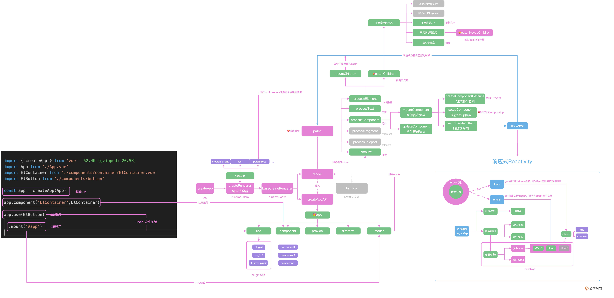

<!--
 * @Author: zhangyu
 * @Email: zhangdulin@outlook.com
 * @Date: 2022-09-21 18:51:48
 * @LastEditors: zhangyu
 * @LastEditTime: 2023-02-25 14:02:45
 * @Description: 
-->

## 29｜运行时：Vue在浏览器里是怎么跑起来的？



Vue 通过 createApp 创建应用，并且执行返回的 mount 方法实现在浏览器中的挂载，在 createApp 中，通过传递浏览器平台的操作方法 nodeOps 创建了浏览器的渲染器 renderer。

首次执行 Vue 项目的时候，通过 patch 实现组件的渲染，patch 函数内部根据节点的不同类型，去分别执行 processElement、processComponent、processText 等方法去递归处理不同类型的节点，最终通过 setupComponent 执行组件的 setup 函数，setupRenderEffect 中使用响应式的 effect 函数监听数据的变化。

github

https://github.com/shengxinjing/weiyouyi

```js
```
<Gitalk />
