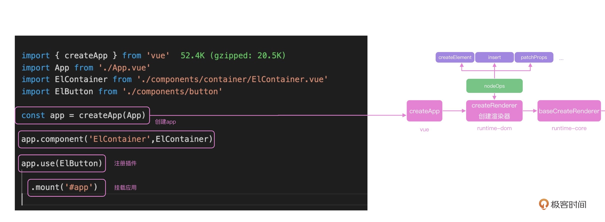
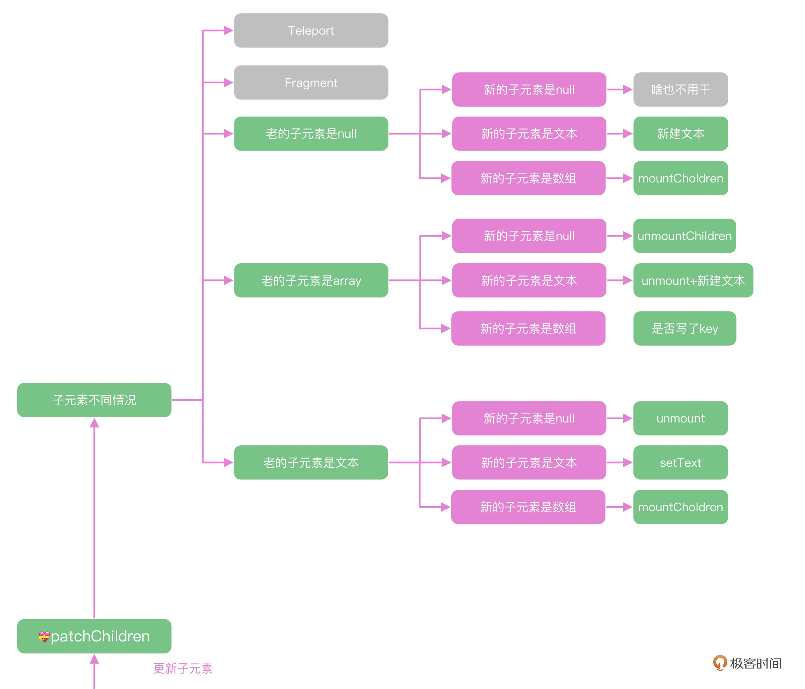

<!--
 * @Author: zhangyu
 * @Email: zhangdulin@outlook.com
 * @Date: 2022-09-21 18:51:48
 * @LastEditors: zhangyu
 * @LastEditTime: 2023-02-25 15:11:49
 * @Description: 
-->

## 30｜虚拟DOM（上）：如何通过虚拟DOM更新页面？



DOM 的创建
```js

const vnode = createVNode(    
  rootComponent as ConcreteComponent,
  rootProps
)
function _createVNode() {

  // 处理属性和class
  if (props) {
    ...
  }

  // 标记vnode信息
  const shapeFlag = isString(type)
    ? ShapeFlags.ELEMENT
    : __FEATURE_SUSPENSE__ && isSuspense(type)
    ? ShapeFlags.SUSPENSE
    : isTeleport(type)
    ? ShapeFlags.TELEPORT
    : isObject(type)
    ? ShapeFlags.STATEFUL_COMPONENT
    : isFunction(type)
    ? ShapeFlags.FUNCTIONAL_COMPONENT
    : 0

  return createBaseVNode(
    type,
    props,
    children,
    patchFlag,
    dynamicProps,
    shapeFlag,
    isBlockNode,
    true
  )
}

function createBaseVNode(type,props,children,...){
    const vnode = {
    type,
    props,
    key: props && normalizeKey(props),
    ref: props && normalizeRef(props),
    children,
    shapeFlag,
    patchFlag,
    dynamicProps,
     ...
  } as VNode
  // 标准化子节点
  if (needFullChildrenNormalization) {
    normalizeChildren(vnode, children)
  } else if (children) {
    vnode.shapeFlag |= isString(children)
      ? ShapeFlags.TEXT_CHILDREN
      : ShapeFlags.ARRAY_CHILDREN
  }
  return vnode
}componentUpdateFn
```
Vue 源码中的实现首次渲染和更新的逻辑都写在一起，我们在递归的时候如果对一个标签实现更新和渲染，就可以用一个函数实现。

```JS

const componentUpdateFn = ()=>{
  if (!instance.isMounted) {
      //首次渲染
      instance,
        parentSuspense,
        isSVG
      )
      。。。
  }else{
    let { next, bu, u, parent, vnode } = instance
    if (next) {
      next.el = vnode.el
      updateComponentPreRender(instance, next, optimized)
    } else {
      next = vnode
    }
    const nextTree = renderComponentRoot(instance)
      patch(
        prevTree,
        nextTree,
        // parent may have changed if it's in a teleport
        hostParentNode(prevTree.el!)!,
        // anchor may have changed if it's in a fragment
        getNextHostNode(prevTree),
        instance,
        parentSuspense,
        isSVG
      )
    }
}

// 注册effect函数
const effect = new ReactiveEffect(
  componentUpdateFn,
  () => queueJob(instance.update),
  instance.scope // track it in component's effect scope
)
const update = (instance.update = effect.run.bind(effect) as S      chedulerJob)
update()

  const updateComponentPreRender = (
    instance: ComponentInternalInstance,
    nextVNode: VNode,
    optimized: boolean
  ) => {
    nextVNode.component = instance
    const prevProps = instance.vnode.props
    instance.vnode = nextVNode
    instance.next = null
    updateProps(instance, nextVNode.props, prevProps, optimized)
    updateSlots(instance, nextVNode.children, optimized)

    pauseTracking()
    // props update may have triggered pre-flush watchers.
    // flush them before the render update.
    flushPreFlushCbs(undefined, instance.update)
    resetTracking()
  }
```
节点自身属性的更新先看自身属性的更新，这里就能体现出 Vue 3 中性能优化的思想，通过 patchFlag 可以做到按需更新：
而子元素的更新是 patchChildren 函数负责的，这个函数也是虚拟 DOM 中难度最高的一个函数，搞懂它还需要我们下一讲中介绍的算法知识，今天我们就先理解它主要的实现思路。首先我们把子元素分成了文本、数组和空三个状态，新老子元素分别是这三种状态的一个，构成了不同的执行逻辑。这样 patchChildren 内部大致有五种情况需要处理：如果新的子元素是空， 老的子元素不为空，直接卸载 unmount 即可。如果新的子元素不为空，老的子元素是空，直接创建加载即可。如果新的子元素是文本，老的子元素如果是数组就需要全部 unmount，是文本的话就需要执行 hostSetElementText。如果新的子元素是数组，比如是使用 v-for 渲染出来的列表，老的子元素如果是空或者文本，直接 unmout 后，渲染新的数组即可。

```JS

  const patchChildren: PatchChildrenFn = (
    n1,
    n2,
    container,
    anchor,
    parentComponent,
    parentSuspense,
    isSVG,
    slotScopeIds,
    optimized = false
  ) => {
    const c1 = n1 && n1.children
    const prevShapeFlag = n1 ? n1.shapeFlag : 0
    const c2 = n2.children

    const { patchFlag, shapeFlag } = n2
    // fast path
    if (patchFlag > 0) {
      if (patchFlag & PatchFlags.KEYED_FRAGMENT) {
        // this could be either fully-keyed or mixed (some keyed some not)
        // presence of patchFlag means children are guaranteed to be arrays
        patchKeyedChildren(
          c1 as VNode[],
          c2 as VNodeArrayChildren,
          container,
          anchor,
          parentComponent,
          parentSuspense,
          isSVG,
          slotScopeIds,
          optimized
        )
        return
      } else if (patchFlag & PatchFlags.UNKEYED_FRAGMENT) {
        // unkeyed
        patchUnkeyedChildren(
          c1 as VNode[],
          c2 as VNodeArrayChildren,
          container,
          anchor,
          parentComponent,
          parentSuspense,
          isSVG,
          slotScopeIds,
          optimized
        )
        return
      }
    }

    // children has 3 possibilities: text, array or no children.
    if (shapeFlag & ShapeFlags.TEXT_CHILDREN) {
      // text children fast path
      if (prevShapeFlag & ShapeFlags.ARRAY_CHILDREN) {
        unmountChildren(c1 as VNode[], parentComponent, parentSuspense)
      }
      if (c2 !== c1) {
        hostSetElementText(container, c2 as string)
      }
    } else {
      if (prevShapeFlag & ShapeFlags.ARRAY_CHILDREN) {
        // prev children was array
        if (shapeFlag & ShapeFlags.ARRAY_CHILDREN) {
          // two arrays, cannot assume anything, do full diff
          patchKeyedChildren(
            c1 as VNode[],
            c2 as VNodeArrayChildren,
            container,
            anchor,
            parentComponent,
            parentSuspense,
            isSVG,
            slotScopeIds,
            optimized
          )
        } else {
          // no new children, just unmount old
          unmountChildren(c1 as VNode[], parentComponent, parentSuspense, true)
        }
      } else {
        // prev children was text OR null
        // new children is array OR null
        if (prevShapeFlag & ShapeFlags.TEXT_CHILDREN) {
          hostSetElementText(container, '')
        }
        // mount new if array
        if (shapeFlag & ShapeFlags.ARRAY_CHILDREN) {
          mountChildren(
            c2 as VNodeArrayChildren,
            container,
            anchor,
            parentComponent,
            parentSuspense,
            isSVG,
            slotScopeIds,
            optimized
          )
        }
      }
    }
  }
```


Vue 响应式驱动了组件之间的数据通信机制，数据更新之后，组件会执行 intance.update 方法，update 方法内部执行 patch 方法进行新老子树的 diff 计算。

在更新函数中，主要做了两件事，pathProps 更新节点自身的属性，这里面使用了 pathFlags 做到了按需更新；patchChildren 执行子元素的更新。其中 patch 函数内部会只对节点内部的动态属性做更新，这种按需更新的机制是 Vue 性能优秀的一个原因。

函数内部针对新老子元素不同的状态，执行不同的逻辑。根据子元素是否为空或者数组，以及新元素是否为空或者数组，分别执行对应的删除或者 mount 逻辑，其中最复杂的就是新的子元素和老的子元素都是数组。

为了最大化减少 DOM 操作，patchKeyedChildren 使用了最长递增子序列来实现，并且相比于 React 的虚拟 DOM diff，新增了双端的预先判断 + 最长递增子序列算法来实现，这也是 Vue 性能比较优秀的另外一个原因。


###  31｜虚拟DOM（下）：想看懂虚拟DOM算法，先刷个算法题
所以我们看每个节点 diff 的时候会做什么，在 renderer.ts 代码文件中就可以看到代码，主要就是通过虚拟 DOM 节点的 patchFlag 树形判断是否需要更新节点。

方法就是使用 & 操作符来判断操作的类型，比如 patchFlag & PatchFlags.CLASS 来判断当前元素的 class 是否需要计算 diff；shapeFlag & ShapeFlags.ELEMENT 来判断当前虚拟 DOM 是 HTML 元素还是 Component 组件。这个“&”其实就是位运算的按位与。

2 的幂次方就是数字 1 左移动若干次，其余位置全部都是 0，所以 n-1 就是最高位变成 0，其余位置都变成 1，就像十进制里的 10000-1 = 9999。这样，n 和 n-1 每个二进制位的数字都不一样，我们可以很轻松地用按位“与”来判断这个题的答案，如果 n&n-1 是 0 的话，数字 n 就符合 2 的整次幂的特点：

```js

16
10000
16-1 = 15
01111
16&15 == 0

var isPowerOfTwo = function(n) {
    return n>0 && (n & (n - 1)) === 0
};
```

比如，一个节点如果 TEXT 和 STYLE 都需要修改，我们只需要使用 | 运算符就可以得到 flag1 的权限表示，这就是为什么 Vue 3 中针对虚拟 DOM 类型以及虚拟 DOM 需要动态计算 diff 的树形都做了标记，你可以在Vue 3 的源码中看到下面的配置：
```js

const PatchFlags = {
  TEXT:1,      // 0001
  CLASS: 1<<1, // 0010
  STYLE:1<<2,  // 0100 
  PROPS:1<<3   // 1000
}

const flag1 = PatchFlags.TEXT | PatchFlags.STYLE // 0101

// 权限校验

flag1 & PatchFlags.TEXT  // 有权限，结果大于1
flag1 & PatchFlags.CLASS //没有权限 是0
```

贪心 + 二分

```js

/**
 * @param {number[]} nums
 * @return {number}
 */
const lengthOfLIS = function(nums) {
    let len = nums.length
    if (len <= 1) {
        return len
    }
    let arr = [nums[0]]
    for (let i = 0; i < len; i++) {
        // nums[i] 大于 arr 尾元素时，直接追加到后面，递增序列长度+1
        if (nums[i] > arr[arr.length - 1]) {
            arr.push(nums[i])
        } else {
            // 否则，查找递增子序列中第一个大于numsp[i]的元素 替换它
            // 递增序列，可以使用二分查找
            let left = 0
            let right = arr.length - 1
            while (left < right) {
                let mid = (left + right) >> 1
                if (arr[mid] < nums[i]) {
                    left = mid + 1
                } else {
                    right = mid
                }
            }
            arr[left] = nums[i]
        }
    }
    return arr.length
};
```
分析了 Vue 3 中虚拟 DOM diff 中的静态标记功能，标记后通过位运算，可以快速判断出一个节点的类型是 HTML 标签还是 Vue 组件，

然后去执行不同的操作方法；在节点更新的流程中，也可以通过位运算的方式确定需要更新的范围。位运算就是通过二进制上的与和或运算，能够高效地进行权限的判断，我们在工作中如果涉及权限的判断，也可以借鉴类似的思路，Linux 中的读写权限也是通过位运算的方式来实现的。

然后我们剖析了 Vue 的虚拟 DOM 中最为复杂的最长递增子序列算法，通过对 LeetCode 第 300 的题分析掌握了动态规划和贪心 + 二分的解法。掌握算法思想之后，

我们再回到 Vue3 的源码中分析代码的实现逻辑，patchKeyedChildren 的核心逻辑就是在进行双端对比后，对无法预判的序列计算出最长递增子序列之后，我们通过编译数组，对其余的元素进行 patch 或者 move 的操作，完整实现了虚拟 DOM 的 diff。

学到这里相信你已经完全搞懂了虚拟 DOM 的执行，以及关键的 diff 操作思路，可以体会到 Vue 中极致的优化理念，使用位运算对 Vue 中的动态属性和节点进行标记，实现高效判断；对于两个数组的 diff 计算使用了最长递增子序列算法实现，优化了 diff 的时间复杂度。这也是为什么我一直建议刚入行的前端工程师要好好学习算法的主要原因。
<Gitalk />
