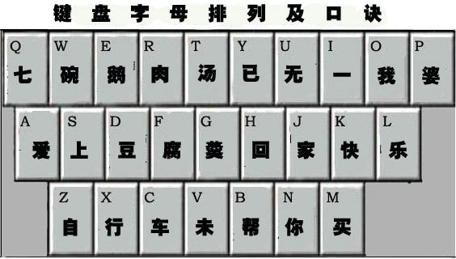
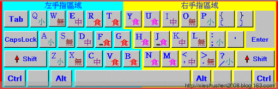

<!--
 * @Author: zhangyu
 * @Email: zhangdulin@outlook.com
 * @Date: 2021-07-10 13:50:04
 * @LastEditors: zhangyu
 * @LastEditTime: 2022-11-14 14:01:18
 * @Description:
-->

### 快速记住键盘字母排列顺序的口诀， 学会盲打

众所周知,计算机键盘字母是按一种杂乱无章的顺序排列的。要死记硬背记住 26 个无序字母的排列顺序，显然很困难。而不记住键盘字母的排列顺序，势必影响学习打字和提高打字速度。（有资料显示：当初键盘设计者就是怕打字太快，损坏键盘，故意打乱了字母的排列顺序。）
　 下面的口诀，能帮助你快速记住键盘字母的排列顺序。

爱上一个不爱回家的人

七(qī)碗(wǎn)鹅(é)肉(ròu)汤(tāng)，已( yǐ)无(wú)一(yī)我(wǒ)婆(pó)。
爱(ài)上(shǎng)豆(dòu)腐(fǔ)羹(gēng)。回(huí)家(jiā)快(kuài)乐(lè)。

      自(zì)行(xíng)车(chē)未(V谐音未)帮(bāng)你(nǐ)买(mǎi)。

整篇口诀联想：

七碗鹅肉汤，已经无一碗给我的老婆了（全给我喝了）。老婆却说：“我爱上喝豆腐羹了。你回家我就快乐。”过了一会儿，老婆说：“对不起，你要的自行车，我未帮你买。”

快速记住键盘字母排列顺序的口诀 - 瀛子 - 瀛の小笺

盲打是指在电脑上打字的时候不看键盘。盲打是打字员的基本要求，要想具有一定的打字速度，必须学会盲打。盲打要求打字的人对于键盘有很好的定位能力。练习盲打的最基本方法是记住键盘指法。

很多人不会盲打并不是因为笨，而是没找到一种简单易行的练习方法。按照标准指法，看着键盘按照从 A 到 Z 的顺序打 26 个字母，最多七天你就可以学会盲打了。所谓标准指法就是把你的双手依照下图的位置放在键盘上，即让你的左手食指放在字母 F 上（F 键上有一个小突起，不用眼看，用手指一摸就找得到了。我们通常称之为盲打坐标），右手食指放在字母 J 上（J 键也有一个盲打坐标）然后将四指并列对齐分别放在相邻的键钮上。

教你快速学会盲打 - 笑看风云 - 笑看风云博客

标准指法的第二部分是手指的“平行”移动规律，也就是说从你把手搭到键盘上起，你的每个手的四个手指就要并列对齐并且“同上同下”。标准指法的第三部分是倾斜移动原则，即无论是你的左手还是右手，都要遵从“左高右低”的方式上下移动。也就是说，左手的食指的移动规范是 4 R F V 一条线，右手食指的移动规范是 7 U J M 一条线。

教你快速学会盲打 - 笑看风云 - 笑看风云博客

其中挨着左手食指的 5 T G B 由左手食指去打，同理，靠着右手食指的 6 Y H N 四个键由右手食指去打。

当你对标准指法有了初步印象以后，就可以了解键盘上其它键钮的手指分工了。

教你快速学会盲打 - 笑看风云 - 笑看风云博客

通常情况下，键盘上使用率较高的其它几个键钮还包括：回车确认(Enter)键、空格键、删除键（键盘右上角上的那个 Back space 键）以及双击键(Shift)。

空格键（也称空格棒）是你打字过程中使用频率最高的一个功能键，可以用两手的大拇指随你去敲（大部分人喜欢用右手大拇指，这个不限）；

回车（确认）键是使用率第二的功能键，由右手小指去打；

删除键是在你打字过程中使用频度第三的功能键，通常用于打字错误的修正（删除），也由右手的小指去敲。

所谓双击键(Shift)就是当一个键钮上有两个字符时的辅助选择键，像标注在数字 1 上的 ！，就是在你用右手小指压下(Sheft)键之后，用左手小指敲击数字 1 而打出来的。其它的一些像什么@ 、：——等等等等道理相同，你自己一看就明白了。需要说明的是，由于需要双击选择的键钮在数字键上左右都有分布，所以这个双击键在键盘下面的布局也是左右各放一个，以利于你双手配合好把它打出来。

当你熟悉了这些标准指法以后，剩下的就是按照练习了。也就是说，你可以按照英文 26 个字母的顺序看着键盘依次用标准指法去打它们，以一天练习四个字母计算，最多 7 天你的盲打就基本练习成功了。

在打字的练习过程中，你可以在你的电脑上新建一个文档然后在里面反复练习，其间不要刻意练习快，人的手指头是很聪明的，当你练过一段时间以后，它是会自己去找它所应该去打的那个键钮的，当你真正熟练以后，快只不过是一个顺理成章的事情，正所谓“功到自然成”。

教你快速学会盲打 - 笑看风云 - 笑看风云博客
<Valine />
